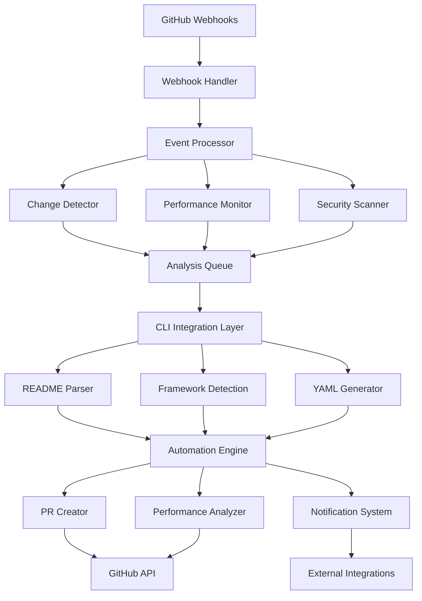

# Agent Hooks Design Document

## Overview

The Agent Hooks component provides intelligent automation capabilities that extend the readme-to-cicd system with proactive monitoring, automated pull request creation, and performance optimization. It leverages GitHub's webhook system and API to provide real-time responses to repository events, continuous performance monitoring, and intelligent workflow improvement suggestions. The component is designed as a microservice that can be deployed independently and integrates seamlessly with the existing CLI and extension components.

The system emphasizes reliability, security, and intelligent automation while maintaining transparency and user control over all automated actions.

## Architecture

### High-Level Architecture



### Core Components

1. **Webhook Handler**: Receives and validates GitHub webhook events
2. **Event Processor**: Analyzes webhook events and determines required actions
3. **Change Detector**: Monitors file changes and project structure modifications
4. **Performance Monitor**: Tracks CI/CD pipeline performance and identifies bottlenecks
5. **Security Scanner**: Monitors for security vulnerabilities and compliance issues
6. **Analysis Queue**: Manages background processing of analysis tasks
7. **CLI Integration Layer**: Interfaces with existing readme-to-cicd components
8. **Automation Engine**: Orchestrates automated actions and decision-making
9. **PR Creator**: Generates and manages automated pull requests
10. **Performance Analyzer**: Provides performance insights and optimization suggestions
11. **Notification System**: Manages alerts, reports, and external integrations

## Components and Interfaces

### 1. Main Agent Hooks Interface

```typescript
interface AgentHooks {
  start(): Promise<void>
  stop(): Promise<void>
  handleWebhook(event: WebhookEvent): Promise<void>
  processAnalysisQueue(): Promise<void>
  generatePerformanceReport(): Promise<PerformanceReport>
}

interface WebhookEvent {
  type: WebhookEventType
  payload: any
  repository: RepositoryInfo
  timestamp: Date
  signature: string
}

enum WebhookEventType {
  PUSH = 'push',
  PULL_REQUEST = 'pull_request',
  RELEASE = 'release',
  WORKFLOW_RUN = 'workflow_run',
  REPOSITORY = 'repository'
}
```

### 2. Automation Engine

```typescript
interface AutomationEngine {
  evaluateChanges(changes: RepositoryChanges): Promise<AutomationDecision>
  createAutomatedPR(decision: AutomationDecision): Promise<PullRequestResult>
  scheduleAnalysis(repository: RepositoryInfo): Promise<void>
  applyCustomRules(rules: AutomationRule[]): Promise<void>
}

interface AutomationDecision {
  shouldCreatePR: boolean
  changes: WorkflowChange[]
  priority: 'low' | 'medium' | 'high' | 'critical'
  rationale: string
  performanceImpact: PerformanceImpact
}

interface WorkflowChange {
  type: 'create' | 'update' | 'delete'
  file: string
  content: string
  description: string
}
```

### 3. Performance Monitoring System

```typescript
interface PerformanceMonitor {
  collectMetrics(workflowRun: WorkflowRunEvent): Promise<void>
  analyzePerformance(repository: RepositoryInfo): Promise<PerformanceAnalysis>
  detectBottlenecks(metrics: PerformanceMetrics[]): Promise<Bottleneck[]>
  generateOptimizationSuggestions(analysis: PerformanceAnalysis): Promise<OptimizationSuggestion[]>
}

interface PerformanceMetrics {
  workflowId: string
  runId: string
  duration: number
  queueTime: number
  jobMetrics: JobMetrics[]
  resourceUsage: ResourceUsage
  timestamp: Date
}

interface PerformanceAnalysis {
  averageDuration: number
  trends: PerformanceTrend[]
  bottlenecks: Bottleneck[]
  optimizationOpportunities: OptimizationSuggestion[]
  performanceScore: number
}
```

### 4. GitHub API Integration

Based on the GitHub MCP server research, the system uses comprehensive GitHub API integration:

```typescript
interface GitHubAPIClient {
  // Pull Request Management
  createPullRequest(params: CreatePRParams): Promise<PullRequest>
  updatePullRequest(params: UpdatePRParams): Promise<PullRequest>
  mergePullRequest(params: MergePRParams): Promise<MergeResult>
  
  // Workflow Management
  listWorkflowRuns(params: ListWorkflowRunsParams): Promise<WorkflowRun[]>
  getWorkflowRunUsage(params: GetUsageParams): Promise<WorkflowUsage>
  cancelWorkflowRun(params: CancelRunParams): Promise<void>
  
  // Repository Operations
  getFileContents(params: GetFileParams): Promise<FileContent>
  createOrUpdateFile(params: CreateFileParams): Promise<FileResult>
  listCommits(params: ListCommitsParams): Promise<Commit[]>
  
  // Security and Compliance
  listCodeScanningAlerts(params: ListAlertsParams): Promise<SecurityAlert[]>
  listSecretScanningAlerts(params: ListSecretsParams): Promise<SecretAlert[]>
  listDependabotAlerts(params: ListDependabotParams): Promise<DependabotAlert[]>
}
```

## Data Models

### Webhook Event Processing

```typescript
interface RepositoryChanges {
  modifiedFiles: FileChange[]
  addedFiles: FileChange[]
  deletedFiles: FileChange[]
  configurationChanges: ConfigChange[]
  dependencyChanges: DependencyChange[]
}

interface FileChange {
  path: string
  type: 'added' | 'modified' | 'deleted'
  content?: string
  previousContent?: string
  significance: 'low' | 'medium' | 'high'
}

interface ConfigChange {
  type: 'package.json' | 'requirements.txt' | 'Cargo.toml' | 'go.mod' | 'dockerfile'
  changes: string[]
  impact: FrameworkImpact[]
}
```

### Automation Rules Engine

```typescript
interface AutomationRule {
  id: string
  name: string
  description: string
  triggers: RuleTrigger[]
  conditions: RuleCondition[]
  actions: RuleAction[]
  priority: number
  enabled: boolean
}

interface RuleTrigger {
  type: 'file_change' | 'dependency_update' | 'security_alert' | 'performance_degradation'
  patterns: string[]
  threshold?: number
}

interface RuleAction {
  type: 'create_pr' | 'create_issue' | 'send_notification' | 'run_analysis'
  parameters: Record<string, any>
  approvalRequired: boolean
}
```

### Performance Monitoring Models

```typescript
interface PerformanceTrend {
  metric: 'duration' | 'queue_time' | 'success_rate' | 'resource_usage'
  direction: 'improving' | 'degrading' | 'stable'
  changePercent: number
  timeframe: string
}

interface Bottleneck {
  type: 'job' | 'step' | 'dependency' | 'resource'
  location: string
  impact: number
  frequency: number
  suggestions: string[]
}

interface OptimizationSuggestion {
  type: 'caching' | 'parallelization' | 'resource_optimization' | 'dependency_update'
  description: string
  estimatedImprovement: number
  implementationComplexity: 'low' | 'medium' | 'high'
  priority: number
}
```

## Error Handling

### Error Categories

1. **Webhook Processing Errors**: Invalid signatures, malformed payloads, processing failures
2. **GitHub API Errors**: Rate limiting, authentication issues, API failures
3. **Analysis Errors**: CLI component failures, parsing errors, generation issues
4. **Automation Errors**: PR creation failures, rule evaluation errors, approval workflow issues
5. **Performance Monitoring Errors**: Metric collection failures, analysis errors

### Error Recovery Strategy

```typescript
interface ErrorHandler {
  handleWebhookError(error: WebhookError): Promise<void>
  handleAPIError(error: GitHubAPIError): Promise<void>
  handleAnalysisError(error: AnalysisError): Promise<void>
  retryWithBackoff(operation: () => Promise<any>, maxRetries: number): Promise<any>
}

interface ErrorRecovery {
  retryPolicy: RetryPolicy
  fallbackActions: FallbackAction[]
  notificationThreshold: number
  escalationRules: EscalationRule[]
}
```

## Testing Strategy

### Unit Testing

- **Webhook Processing**: Test webhook validation, signature verification, and event parsing
- **Automation Rules**: Test rule evaluation, condition matching, and action execution
- **Performance Analysis**: Test metric collection, trend analysis, and optimization suggestions
- **GitHub API Integration**: Test API calls, error handling, and rate limiting

### Integration Testing

- **End-to-End Automation**: Test complete webhook-to-PR workflows
- **CLI Component Integration**: Test integration with README Parser, Framework Detection, and YAML Generator
- **External System Integration**: Test project management and notification integrations
- **Performance Monitoring**: Test real-time metric collection and analysis

### Load Testing

- **Webhook Volume**: Test handling of high-volume webhook events
- **Concurrent Processing**: Test parallel analysis and PR creation
- **API Rate Limiting**: Test GitHub API rate limit handling and queuing
- **Performance Under Load**: Test system performance with multiple repositories

## Implementation Notes

### Deployment Architecture

The Agent Hooks component is designed as a microservice that can be deployed in multiple configurations:

```typescript
interface DeploymentConfig {
  mode: 'standalone' | 'serverless' | 'container'
  scaling: ScalingConfig
  storage: StorageConfig
  monitoring: MonitoringConfig
}

interface ScalingConfig {
  minInstances: number
  maxInstances: number
  targetCPU: number
  targetMemory: number
}
```

### Security Considerations

- **Webhook Security**: Verify GitHub webhook signatures using HMAC-SHA256
- **API Authentication**: Use GitHub Apps or Personal Access Tokens with minimal required permissions
- **Secret Management**: Store sensitive configuration in secure secret management systems
- **Access Control**: Implement role-based access control for automation rules and approvals

### Performance Optimization

- **Queue Management**: Use Redis or similar for reliable job queuing
- **Caching**: Cache GitHub API responses and analysis results
- **Batch Processing**: Batch similar operations to reduce API calls
- **Background Processing**: Use worker processes for long-running analysis tasks

### Monitoring and Observability

```typescript
interface MonitoringSystem {
  metrics: MetricsCollector
  logging: StructuredLogger
  tracing: DistributedTracing
  alerting: AlertManager
}

interface SystemMetrics {
  webhookProcessingTime: number
  queueDepth: number
  apiCallRate: number
  errorRate: number
  automationSuccessRate: number
}
```

### External Integrations

#### Project Management Integration

```typescript
interface ProjectManagementIntegration {
  createTicket(issue: WorkflowIssue): Promise<Ticket>
  updateTicketStatus(ticketId: string, status: TicketStatus): Promise<void>
  linkPRToTicket(prId: string, ticketId: string): Promise<void>
}

// Supported platforms: Jira, Linear, GitHub Issues, Azure DevOps
```

#### Notification Systems

```typescript
interface NotificationSystem {
  sendSlackMessage(channel: string, message: SlackMessage): Promise<void>
  sendEmail(recipients: string[], subject: string, body: string): Promise<void>
  sendWebhook(url: string, payload: any): Promise<void>
  createGitHubIssue(repository: string, issue: IssueData): Promise<Issue>
}
```

### Configuration Management

```typescript
interface AgentHooksConfig {
  github: GitHubConfig
  automation: AutomationConfig
  performance: PerformanceConfig
  integrations: IntegrationConfig
  security: SecurityConfig
}

interface AutomationConfig {
  enabledFeatures: string[]
  defaultRules: AutomationRule[]
  approvalWorkflows: ApprovalWorkflow[]
  batchingConfig: BatchingConfig
}
```

### Webhook Event Handling

Based on GitHub webhooks documentation, the system handles these key events:

```typescript
interface WebhookEventHandlers {
  onPush(event: PushEvent): Promise<void>
  onPullRequest(event: PullRequestEvent): Promise<void>
  onWorkflowRun(event: WorkflowRunEvent): Promise<void>
  onRelease(event: ReleaseEvent): Promise<void>
  onRepository(event: RepositoryEvent): Promise<void>
}

// Event processing priorities
enum EventPriority {
  CRITICAL = 1, // Security alerts, workflow failures
  HIGH = 2,     // README changes, dependency updates
  MEDIUM = 3,   // Performance issues, optimization opportunities
  LOW = 4       // Documentation updates, minor changes
}
```