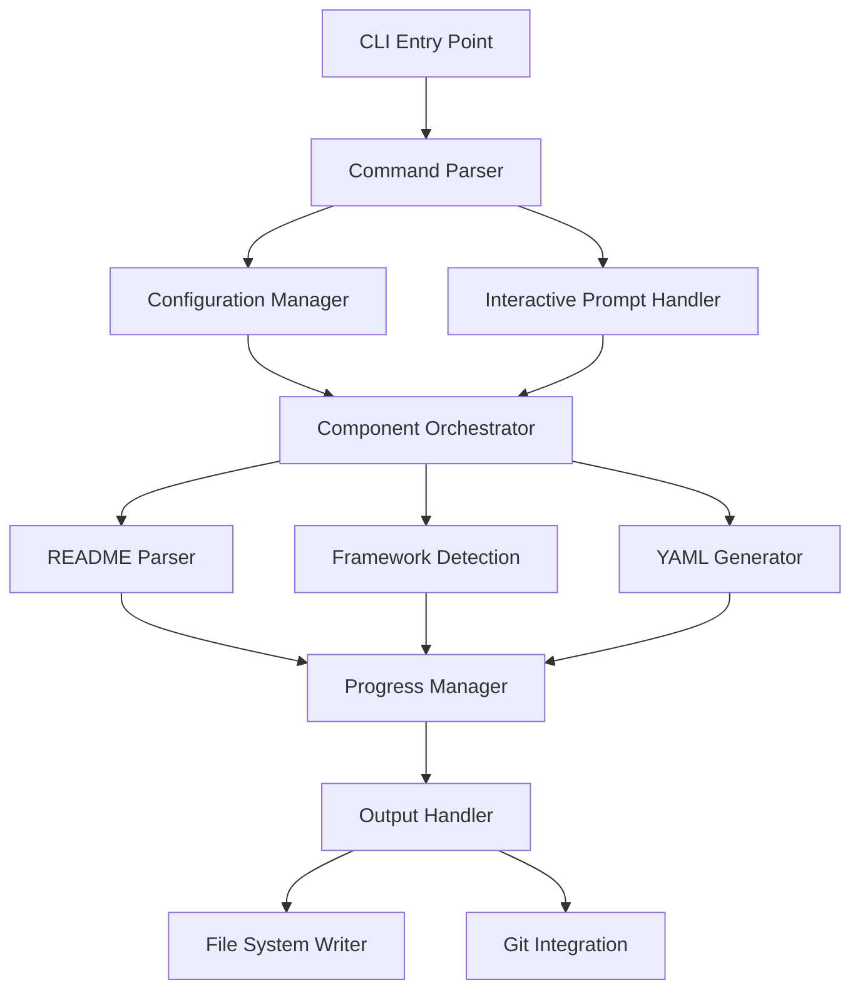

# CLI Tool Design Document

## Overview

The CLI Tool component provides a command-line interface that integrates the README Parser, Framework Detection, and YAML Generator components into a cohesive user experience. It follows Node.js CLI best practices with support for interactive prompts, configuration management, progress indicators, and comprehensive error handling. The tool is designed to be both developer-friendly for local use and automation-ready for CI/CD environments.

The CLI emphasizes user experience through intelligent defaults, helpful error messages, and flexible configuration options while maintaining compatibility with standard POSIX command-line conventions.

## Architecture

### High-Level Architecture



### Core Components

1. **CLI Entry Point**: Main executable with argument parsing and command routing
2. **Command Parser**: Handles command-line arguments using commander.js
3. **Configuration Manager**: Manages settings using cosmiconfig for flexible configuration
4. **Interactive Prompt Handler**: Provides user prompts using inquirer for interactive mode
5. **Component Orchestrator**: Coordinates the README Parser, Framework Detection, and YAML Generator
6. **Progress Manager**: Shows progress indicators using ora for long-running operations
7. **Output Handler**: Manages file output, validation, and user feedback
8. **Git Integration**: Handles version control operations and change tracking

## Components and Interfaces

### 1. Main CLI Interface

```typescript
interface CLITool {
  run(args: string[]): Promise<CLIResult>
  parseArguments(args: string[]): CLIOptions
  loadConfiguration(configPath?: string): Promise<CLIConfig>
}

interface CLIResult {
  success: boolean
  generatedFiles: string[]
  errors: CLIError[]
  warnings: string[]
  summary: ExecutionSummary
}

interface CLIOptions {
  command: 'generate' | 'validate' | 'init' | 'export' | 'import'
  readmePath?: string
  outputDir?: string
  workflowType?: WorkflowType[]
  framework?: string[]
  dryRun: boolean
  interactive: boolean
  verbose: boolean
  debug: boolean
  quiet: boolean
  config?: string
}
```

### 2. Configuration System

```typescript
interface CLIConfig {
  defaults: DefaultSettings
  templates: TemplateConfig
  organization: OrganizationPolicies
  output: OutputConfig
  git: GitConfig
  ui: UIConfig
}

interface DefaultSettings {
  outputDirectory: string
  workflowTypes: WorkflowType[]
  includeComments: boolean
  optimizationLevel: 'basic' | 'standard' | 'aggressive'
}

interface TemplateConfig {
  customTemplates?: string
  templateOverrides?: Record<string, any>
  organizationTemplates?: string
}
```

### 3. Interactive Prompt System

```typescript
interface PromptHandler {
  confirmFrameworks(detected: FrameworkInfo[]): Promise<FrameworkInfo[]>
  resolveConflicts(conflicts: FrameworkConflict[]): Promise<ConflictResolution[]>
  selectWorkflowTypes(): Promise<WorkflowType[]>
  configureDeployment(options: DeploymentOption[]): Promise<DeploymentConfig>
}

interface FrameworkConflict {
  type: 'multiple-frameworks' | 'version-mismatch' | 'incompatible-tools'
  frameworks: FrameworkInfo[]
  message: string
  suggestions: string[]
}
```

## Data Models

### Command Structure

The CLI supports multiple commands with subcommands and options:

```bash
# Basic generation
readme-to-cicd generate [path]

# Interactive mode
readme-to-cicd generate --interactive

# Specific workflow types
readme-to-cicd generate --workflow-type ci,cd

# Validation
readme-to-cicd validate [workflow-path]

# Configuration
readme-to-cicd init
readme-to-cicd export --output config.json
readme-to-cicd import --config config.json

# Batch processing
readme-to-cicd generate --recursive --parallel
```

### Configuration File Structure

Based on cosmiconfig research, the CLI supports multiple configuration formats:

```json
// .readme-to-cicd.json
{
  "defaults": {
    "outputDirectory": ".github/workflows",
    "workflowTypes": ["ci", "cd"],
    "includeComments": true,
    "optimizationLevel": "standard"
  },
  "templates": {
    "customTemplates": "./templates",
    "organizationTemplates": "@company/cicd-templates"
  },
  "organization": {
    "requiredSecurityScans": true,
    "mandatorySteps": ["security-scan", "dependency-check"],
    "allowedActions": ["actions/*", "@company/*"]
  },
  "git": {
    "autoCommit": false,
    "commitMessage": "feat: add automated CI/CD workflows",
    "createPR": false
  }
}
```

### Progress and User Feedback

```typescript
interface ProgressManager {
  startSpinner(text: string): Spinner
  updateProgress(current: number, total: number, message: string): void
  logStep(step: string, status: 'start' | 'success' | 'error' | 'skip'): void
  showSummary(result: CLIResult): void
}

interface Spinner {
  text: string
  succeed(text?: string): void
  fail(text?: string): void
  warn(text?: string): void
  info(text?: string): void
}
```

## Error Handling

### Error Categories

1. **User Input Errors**: Invalid arguments, missing files, incorrect paths
2. **Configuration Errors**: Invalid config files, missing templates, policy violations
3. **Processing Errors**: README parsing failures, framework detection issues, YAML generation errors
4. **File System Errors**: Permission issues, disk space, file conflicts
5. **Git Integration Errors**: Repository issues, commit failures, branch conflicts

### Error Recovery Strategy

```typescript
interface ErrorHandler {
  handleUserInputError(error: UserInputError): CLIResponse
  handleConfigurationError(error: ConfigError): CLIResponse
  handleProcessingError(error: ProcessingError): CLIResponse
  suggestFixes(error: CLIError): string[]
}

interface CLIError {
  code: string
  message: string
  category: ErrorCategory
  severity: 'error' | 'warning' | 'info'
  suggestions: string[]
  context?: any
}
```

### User-Friendly Error Messages

Based on CLI best practices research:

- **Clear Error Messages**: Specific, actionable error descriptions
- **Suggestion Engine**: Automatic suggestions for common mistakes
- **Context Preservation**: Show relevant file paths and line numbers
- **Recovery Options**: Offer ways to fix or work around issues

## Testing Strategy

### Unit Testing

- **Command Parsing**: Test argument parsing with various input combinations
- **Configuration Loading**: Test config file loading and validation
- **Component Integration**: Test orchestration of parser, detection, and generator
- **Error Handling**: Test error scenarios and recovery mechanisms

### Integration Testing

- **End-to-End Workflows**: Test complete CLI execution from input to output
- **Interactive Mode**: Test prompt flows and user input handling
- **File System Operations**: Test file creation, validation, and Git integration
- **Configuration Scenarios**: Test various config file formats and locations

### User Experience Testing

- **Command Discoverability**: Test help system and command suggestions
- **Error Message Quality**: Validate error messages are helpful and actionable
- **Progress Feedback**: Test progress indicators and user feedback
- **Performance**: Test CLI responsiveness and execution time

## Implementation Notes

### Library Dependencies

Based on research findings:

- **commander**: Command-line argument parsing with subcommands and help generation
- **cosmiconfig**: Flexible configuration file loading with multiple format support
- **inquirer**: Interactive prompts with validation and conditional logic
- **ora**: Elegant terminal spinners with customizable styles
- **chalk**: Terminal string styling for colored output
- **boxen**: Terminal boxes for important messages and summaries

### Performance Considerations

- **Lazy Loading**: Load components only when needed to reduce startup time
- **Async Operations**: Use async/await for all I/O operations
- **Progress Feedback**: Show progress for operations taking >1 second
- **Caching**: Cache configuration and template parsing results

### User Experience Design

#### Command Design Principles

1. **Sensible Defaults**: Work without configuration for common use cases
2. **Progressive Disclosure**: Simple commands with advanced options available
3. **Consistent Patterns**: Follow established CLI conventions and patterns
4. **Helpful Feedback**: Clear progress indicators and informative messages

#### Interactive Mode Flow

```typescript
interface InteractiveFlow {
  welcomeMessage(): void
  detectAndConfirmFrameworks(): Promise<FrameworkInfo[]>
  selectWorkflowTypes(): Promise<WorkflowType[]>
  configureAdvancedOptions(): Promise<AdvancedConfig>
  reviewAndConfirm(): Promise<boolean>
  executeGeneration(): Promise<CLIResult>
  showSummary(): void
}
```

### CI/CD Integration

#### Environment Detection

```typescript
interface CIEnvironment {
  isCI(): boolean
  getCIProvider(): 'github' | 'gitlab' | 'jenkins' | 'azure' | 'unknown'
  getEnvironmentVariables(): Record<string, string>
  shouldUseNonInteractiveMode(): boolean
}
```

#### Machine-Readable Output

```typescript
interface MachineOutput {
  format: 'json' | 'xml' | 'yaml'
  result: CLIResult
  metadata: {
    version: string
    timestamp: string
    environment: string
  }
}
```

### Extensibility Design

- **Plugin Architecture**: Support for custom commands and processors
- **Hook System**: Pre/post execution hooks for customization
- **Template Providers**: Pluggable template sources and formats
- **Output Formatters**: Custom output format support

### Security Considerations

- **Input Validation**: Sanitize all user inputs and file paths
- **Template Security**: Validate custom templates for security issues
- **File Permissions**: Respect file system permissions and ownership
- **Secret Handling**: Never log or expose sensitive configuration data