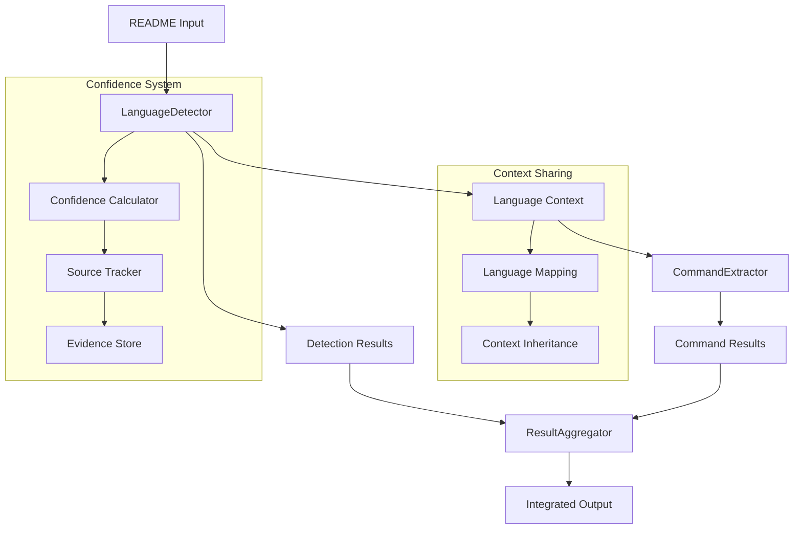

# Design Document

## Overview

This design addresses the core integration issues in the README parser system by establishing proper data flow patterns, context sharing mechanisms, and confidence scoring algorithms. The solution focuses on three main areas: implementing language context inheritance between CommandExtractor and LanguageDetector, enhancing LanguageDetector's confidence scoring and source tracking capabilities, and ensuring proper data flow integration in ResultAggregator.

## Architecture

### Component Integration Flow



### Data Flow Architecture

The integration fixes establish a clear data flow where:
1. LanguageDetector processes README content and generates both detection results and language context
2. Language context is shared with CommandExtractor through a context inheritance mechanism
3. CommandExtractor uses inherited context to properly associate commands with languages
4. ResultAggregator receives outputs from both components and performs intelligent aggregation
5. Confidence scores and source tracking information flow through all components

## Components and Interfaces

### LanguageContext Interface

```typescript
interface LanguageContext {
  language: string;
  confidence: number;
  sourceRange: SourceRange;
  evidence: Evidence[];
  parentContext?: LanguageContext;
}

interface SourceRange {
  startLine: number;
  endLine: number;
  startColumn: number;
  endColumn: number;
}

interface Evidence {
  type: 'keyword' | 'extension' | 'syntax' | 'dependency';
  value: string;
  confidence: number;
  location: SourceRange;
}
```

### Enhanced LanguageDetector

```typescript
interface EnhancedLanguageDetector {
  detect(content: string): DetectionResult;
  getContext(position: number): LanguageContext;
  getConfidenceScore(language: string, evidence: Evidence[]): number;
  trackSource(detection: Detection): SourceTracking;
}

interface DetectionResult {
  languages: LanguageDetection[];
  contexts: LanguageContext[];
  overallConfidence: number;
}

interface LanguageDetection {
  language: string;
  confidence: number;
  evidence: Evidence[];
  sourceTracking: SourceTracking;
}
```

### Context-Aware CommandExtractor

```typescript
interface ContextAwareCommandExtractor {
  extractWithContext(content: string, context: LanguageContext[]): CommandExtractionResult;
  inheritContext(context: LanguageContext): void;
  associateCommand(command: Command, context: LanguageContext): AssociatedCommand;
}

interface CommandExtractionResult {
  commands: AssociatedCommand[];
  contextMappings: ContextMapping[];
  extractionMetadata: ExtractionMetadata;
}

interface AssociatedCommand extends Command {
  languageContext: LanguageContext;
  contextConfidence: number;
}
```

### Integrated ResultAggregator

```typescript
interface IntegratedResultAggregator {
  aggregate(results: AnalyzerResult[]): AggregatedResult;
  resolveConflicts(conflictingResults: AnalyzerResult[]): ResolvedResult;
  validateIntegration(result: AggregatedResult): ValidationResult;
  calculateOverallConfidence(results: AnalyzerResult[]): number;
}

interface AggregatedResult {
  languages: LanguageDetection[];
  commands: AssociatedCommand[];
  overallConfidence: number;
  integrationMetadata: IntegrationMetadata;
  validationStatus: ValidationStatus;
}
```

## Data Models

### Confidence Scoring Model

The confidence scoring system uses a weighted algorithm that considers:
- **Strong Indicators** (0.8-1.0): File extensions, explicit language declarations, framework-specific syntax
- **Medium Indicators** (0.5-0.7): Keywords, common patterns, dependency names
- **Weak Indicators** (0.2-0.4): Generic terms, ambiguous syntax, contextual hints

```typescript
interface ConfidenceCalculator {
  calculateBaseConfidence(evidence: Evidence[]): number;
  applyBoostFactors(baseConfidence: number, indicators: StrongIndicator[]): number;
  aggregateMultipleScores(scores: ConfidenceScore[]): number;
}

interface StrongIndicator {
  type: 'file_extension' | 'framework_declaration' | 'syntax_pattern';
  weight: number;
  boostFactor: number;
}
```

### Context Inheritance Model

```typescript
interface ContextInheritance {
  parentContext: LanguageContext;
  childContexts: LanguageContext[];
  inheritanceRules: InheritanceRule[];
  contextBoundaries: ContextBoundary[];
}

interface InheritanceRule {
  condition: string;
  action: 'inherit' | 'override' | 'merge';
  priority: number;
}
```

## Error Handling

### Integration Error Types

```typescript
class ContextInheritanceError extends Error {
  constructor(message: string, public context: LanguageContext, public component: string) {
    super(`Context inheritance failed in ${component}: ${message}`);
  }
}

class ConfidenceAggregationError extends Error {
  constructor(message: string, public scores: number[], public algorithm: string) {
    super(`Confidence aggregation failed using ${algorithm}: ${message}`);
  }
}

class DataFlowIntegrationError extends Error {
  constructor(message: string, public sourceComponent: string, public targetComponent: string) {
    super(`Data flow integration failed from ${sourceComponent} to ${targetComponent}: ${message}`);
  }
}
```

### Error Recovery Strategies

1. **Context Inheritance Failures**: Fall back to default language context with low confidence
2. **Confidence Calculation Errors**: Use conservative confidence scores and log warnings
3. **Data Flow Interruptions**: Continue with partial results and mark incomplete sections
4. **Integration Validation Failures**: Provide detailed diagnostics and suggested fixes

## Testing Strategy

### Unit Testing Approach

- **LanguageDetector**: Test confidence calculation algorithms with various evidence combinations
- **CommandExtractor**: Test context inheritance with different language context scenarios
- **ResultAggregator**: Test data flow integration with mock analyzer outputs
- **Integration Components**: Test error handling and recovery mechanisms

### Integration Testing Approach

- **End-to-End Workflow**: Test complete README processing with real-world examples
- **Component Interaction**: Test data flow between all component pairs
- **Context Propagation**: Test language context inheritance across component boundaries
- **Confidence Aggregation**: Test confidence score calculation and aggregation accuracy

### Validation Testing Approach

- **TypeScript Compilation**: Ensure all interfaces compile without errors
- **Data Contract Validation**: Verify all component interfaces match expected contracts
- **Performance Validation**: Ensure integration fixes don't degrade performance
- **Regression Testing**: Verify existing functionality remains intact after fixes