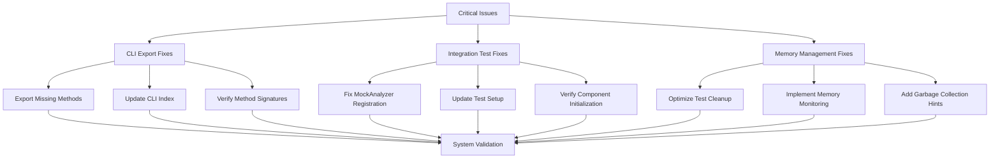

# Design Document

## Overview

This design addresses the three most critical system-level issues blocking the README-to-CICD system: missing CLI method exports, integration test failures, and memory management problems. The solution focuses on immediate fixes that restore system stability without introducing architectural changes. The approach prioritizes surgical fixes that resolve specific blocking issues while maintaining existing functionality and interfaces.

## Architecture

### Fix Strategy Overview



### Component Impact Analysis

The fixes target specific components without requiring architectural changes:
- **CLI Module**: Export missing methods and ensure proper module structure
- **Integration Tests**: Fix test setup and component registration logic
- **Test Infrastructure**: Improve memory management and cleanup processes
- **Build System**: Validate fixes through comprehensive testing

## Components and Interfaces

### CLI Export Fixes

#### Missing Method Implementations

Based on the status report, these methods need to be properly exported:

```typescript
// src/cli/index.ts - Required exports
export interface CLIExports {
  writeWorkflowFiles(workflows: WorkflowFile[], outputDir: string): Promise<void>;
  updateOptions(options: Partial<CLIOptions>): Promise<void>;
  validateOutputDirectory(directory: string): Promise<ValidationResult>;
  
  // Existing exports that should remain
  OutputHandler: typeof OutputHandler;
  ErrorHandler: typeof ErrorHandler;
  // ... other existing exports
}

interface WorkflowFile {
  name: string;
  content: string;
  path: string;
}

interface CLIOptions {
  outputDirectory: string;
  templatePath?: string;
  verbose: boolean;
  dryRun: boolean;
}

interface ValidationResult {
  isValid: boolean;
  errors: string[];
  warnings: string[];
}
```

#### Implementation Strategy

```typescript
// src/cli/workflow-writer.ts - New implementation
export class WorkflowWriter {
  async writeWorkflowFiles(workflows: WorkflowFile[], outputDir: string): Promise<void> {
    // Validate output directory
    await this.ensureDirectoryExists(outputDir);
    
    // Write each workflow file
    for (const workflow of workflows) {
      const fullPath = path.join(outputDir, workflow.path, workflow.name);
      await fs.writeFile(fullPath, workflow.content, 'utf8');
    }
  }
  
  private async ensureDirectoryExists(directory: string): Promise<void> {
    try {
      await fs.access(directory);
    } catch {
      await fs.mkdir(directory, { recursive: true });
    }
  }
}

// src/cli/options-manager.ts - New implementation  
export class OptionsManager {
  private options: CLIOptions;
  
  async updateOptions(newOptions: Partial<CLIOptions>): Promise<void> {
    this.options = { ...this.options, ...newOptions };
    await this.persistOptions();
  }
  
  private async persistOptions(): Promise<void> {
    // Persist options to configuration file
    const configPath = path.join(process.cwd(), '.readme-to-cicd.json');
    await fs.writeFile(configPath, JSON.stringify(this.options, null, 2));
  }
}

// src/cli/directory-validator.ts - New implementation
export class DirectoryValidator {
  async validateOutputDirectory(directory: string): Promise<ValidationResult> {
    const result: ValidationResult = {
      isValid: true,
      errors: [],
      warnings: []
    };
    
    try {
      // Check if directory exists
      await fs.access(directory);
      
      // Check if directory is writable
      await fs.access(directory, fs.constants.W_OK);
      
      // Check if directory is empty (warning, not error)
      const files = await fs.readdir(directory);
      if (files.length > 0) {
        result.warnings.push(`Directory ${directory} is not empty`);
      }
      
    } catch (error) {
      result.isValid = false;
      result.errors.push(`Cannot access directory ${directory}: ${error.message}`);
    }
    
    return result;
  }
}
```

### Integration Test Fixes

#### Component Initialization Test Fix

The failing test expects `MockAnalyzer` to be registered but it's not appearing in the analyzer list.

```typescript
// tests/integration/component-initialization.test.ts - Fix approach
describe('Component Initialization', () => {
  let integrationPipeline: IntegrationPipeline;
  
  beforeEach(() => {
    // Ensure clean state
    integrationPipeline = new IntegrationPipeline();
  });
  
  afterEach(() => {
    // Proper cleanup
    integrationPipeline.cleanup();
  });
  
  it('should register custom analyzers correctly', async () => {
    // Create mock analyzer
    const mockAnalyzer = new MockAnalyzer();
    
    // Register analyzer - fix the registration process
    await integrationPipeline.registerAnalyzer(mockAnalyzer);
    
    // Verify registration - ensure proper retrieval
    const analyzers = integrationPipeline.getRegisteredAnalyzers();
    
    // Fix: Ensure MockAnalyzer is properly identified
    const mockAnalyzerFound = analyzers.find(analyzer => 
      analyzer.constructor.name === 'MockAnalyzer' || 
      analyzer.name === 'MockAnalyzer'
    );
    
    expect(mockAnalyzerFound).toBeDefined();
    expect(analyzers).toHaveLength(6); // 5 default + 1 mock
  });
});

// Fix in IntegrationPipeline class
export class IntegrationPipeline {
  private analyzers: ContentAnalyzer[] = [];
  
  async registerAnalyzer(analyzer: ContentAnalyzer): Promise<void> {
    // Fix: Ensure analyzer is properly added to the list
    this.analyzers.push(analyzer);
    
    // Fix: Ensure analyzer is properly initialized
    if (typeof analyzer.initialize === 'function') {
      await analyzer.initialize();
    }
  }
  
  getRegisteredAnalyzers(): ContentAnalyzer[] {
    // Fix: Return a copy to prevent external modification
    return [...this.analyzers];
  }
  
  cleanup(): void {
    // Fix: Proper cleanup of analyzers
    this.analyzers.forEach(analyzer => {
      if (typeof analyzer.cleanup === 'function') {
        analyzer.cleanup();
      }
    });
    this.analyzers = [];
  }
}
```

### Memory Management Fixes

#### Test Suite Memory Optimization

```typescript
// tests/setup/memory-management.ts - New memory management utilities
export class TestMemoryManager {
  private static instance: TestMemoryManager;
  private memoryThreshold = 500 * 1024 * 1024; // 500MB threshold
  
  static getInstance(): TestMemoryManager {
    if (!TestMemoryManager.instance) {
      TestMemoryManager.instance = new TestMemoryManager();
    }
    return TestMemoryManager.instance;
  }
  
  checkMemoryUsage(): void {
    const usage = process.memoryUsage();
    if (usage.heapUsed > this.memoryThreshold) {
      console.warn(`Memory usage high: ${Math.round(usage.heapUsed / 1024 / 1024)}MB`);
      this.forceGarbageCollection();
    }
  }
  
  forceGarbageCollection(): void {
    if (global.gc) {
      global.gc();
    }
  }
  
  async cleanupTestResources(): Promise<void> {
    // Clear any global test state
    this.clearGlobalTestState();
    
    // Force garbage collection
    this.forceGarbageCollection();
    
    // Wait for cleanup to complete
    await new Promise(resolve => setImmediate(resolve));
  }
  
  private clearGlobalTestState(): void {
    // Clear any cached modules or global state that might be holding references
    delete require.cache[require.resolve('../fixtures/large-readme.md')];
    // Clear other test-specific global state
  }
}

// vitest.config.ts - Update test configuration
export default defineConfig({
  test: {
    // Reduce concurrent tests to manage memory
    pool: 'threads',
    poolOptions: {
      threads: {
        maxThreads: 2,
        minThreads: 1
      }
    },
    
    // Add memory monitoring
    setupFiles: ['./tests/setup/memory-setup.ts'],
    
    // Increase timeout for memory-intensive tests
    testTimeout: 30000,
    
    // Enable garbage collection
    globals: true
  }
});

// tests/setup/memory-setup.ts - Memory monitoring setup
import { TestMemoryManager } from './memory-management';

const memoryManager = TestMemoryManager.getInstance();

// Monitor memory before each test
beforeEach(() => {
  memoryManager.checkMemoryUsage();
});

// Cleanup after each test
afterEach(async () => {
  await memoryManager.cleanupTestResources();
});

// Global cleanup
afterAll(async () => {
  await memoryManager.cleanupTestResources();
});
```

## Data Models

### CLI Method Signatures

```typescript
interface CLIMethodSignatures {
  writeWorkflowFiles: {
    input: {
      workflows: WorkflowFile[];
      outputDir: string;
    };
    output: Promise<void>;
    errors: ['DIRECTORY_NOT_WRITABLE', 'FILE_WRITE_ERROR'];
  };
  
  updateOptions: {
    input: {
      options: Partial<CLIOptions>;
    };
    output: Promise<void>;
    errors: ['INVALID_OPTIONS', 'CONFIG_WRITE_ERROR'];
  };
  
  validateOutputDirectory: {
    input: {
      directory: string;
    };
    output: Promise<ValidationResult>;
    errors: ['DIRECTORY_ACCESS_ERROR'];
  };
}
```

### Test Cleanup Model

```typescript
interface TestCleanupModel {
  memoryThreshold: number;
  cleanupStrategies: CleanupStrategy[];
  monitoringInterval: number;
}

interface CleanupStrategy {
  name: string;
  condition: (usage: NodeJS.MemoryUsage) => boolean;
  action: () => Promise<void>;
  priority: number;
}
```

## Error Handling

### CLI Export Error Handling

```typescript
class CLIExportError extends Error {
  constructor(message: string, public method: string, public cause?: Error) {
    super(`CLI export error for method ${method}: ${message}`);
    this.name = 'CLIExportError';
  }
}

class MethodNotFoundError extends CLIExportError {
  constructor(method: string) {
    super(`Method ${method} is not properly exported`, method);
  }
}
```

### Memory Management Error Handling

```typescript
class MemoryManagementError extends Error {
  constructor(message: string, public memoryUsage: NodeJS.MemoryUsage) {
    super(`Memory management error: ${message}`);
    this.name = 'MemoryManagementError';
  }
}

class TestMemoryExceededError extends MemoryManagementError {
  constructor(usage: NodeJS.MemoryUsage, threshold: number) {
    super(
      `Test memory usage exceeded threshold: ${Math.round(usage.heapUsed / 1024 / 1024)}MB > ${Math.round(threshold / 1024 / 1024)}MB`,
      usage
    );
  }
}
```

## Testing Strategy

### CLI Export Testing

```typescript
describe('CLI Exports', () => {
  it('should export all required methods', () => {
    const cliExports = require('../src/cli');
    
    expect(cliExports.writeWorkflowFiles).toBeDefined();
    expect(typeof cliExports.writeWorkflowFiles).toBe('function');
    
    expect(cliExports.updateOptions).toBeDefined();
    expect(typeof cliExports.updateOptions).toBe('function');
    
    expect(cliExports.validateOutputDirectory).toBeDefined();
    expect(typeof cliExports.validateOutputDirectory).toBe('function');
  });
  
  it('should execute writeWorkflowFiles successfully', async () => {
    const workflows = [
      { name: 'test.yml', content: 'test: content', path: '.github/workflows' }
    ];
    const outputDir = './test-output';
    
    await expect(writeWorkflowFiles(workflows, outputDir)).resolves.not.toThrow();
  });
});
```

### Integration Test Fixes Testing

```typescript
describe('Integration Test Fixes', () => {
  it('should register MockAnalyzer correctly', async () => {
    const pipeline = new IntegrationPipeline();
    const mockAnalyzer = new MockAnalyzer();
    
    await pipeline.registerAnalyzer(mockAnalyzer);
    const analyzers = pipeline.getRegisteredAnalyzers();
    
    expect(analyzers).toContain(mockAnalyzer);
    expect(analyzers.length).toBe(6); // 5 default + 1 mock
  });
});
```

### Memory Management Testing

```typescript
describe('Memory Management', () => {
  it('should not exceed memory threshold during tests', async () => {
    const memoryManager = TestMemoryManager.getInstance();
    const initialUsage = process.memoryUsage();
    
    // Run memory-intensive operations
    await runMemoryIntensiveTest();
    
    const finalUsage = process.memoryUsage();
    const memoryIncrease = finalUsage.heapUsed - initialUsage.heapUsed;
    
    expect(memoryIncrease).toBeLessThan(100 * 1024 * 1024); // Less than 100MB increase
  });
});
```