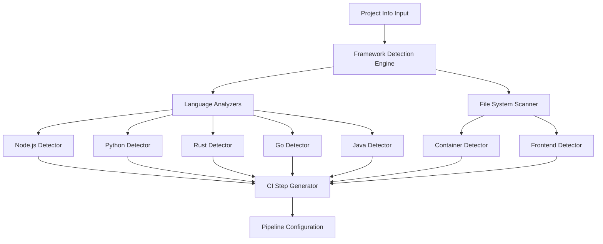

# Framework Detection Design Document

## Overview

The Framework Detection component analyzes project information extracted from README files and file system structure to identify specific frameworks, build tools, and development environments. It provides intelligent CI/CD pipeline step suggestions based on detected frameworks and project patterns. This component integrates with the README Parser to provide comprehensive project analysis for automated workflow generation.

The system uses a rule-based detection engine with confidence scoring, supporting extensible framework definitions and customizable CI step templates.

## Architecture

### High-Level Architecture



### Core Components

1. **Detection Engine**: Orchestrates framework detection across all analyzers
2. **Language Analyzers**: Specialized detectors for each programming language ecosystem
3. **File System Scanner**: Analyzes project structure and configuration files
4. **Confidence Scorer**: Evaluates detection reliability and provides alternatives
5. **CI Step Generator**: Creates framework-specific pipeline steps
6. **Template Manager**: Manages CI/CD step templates and customizations

## Components and Interfaces

### 1. Main Detection Interface

```typescript
interface FrameworkDetector {
  detectFrameworks(projectInfo: ProjectInfo, projectPath?: string): Promise<DetectionResult>
  suggestCISteps(detectionResult: DetectionResult): Promise<CIPipeline>
}

interface DetectionResult {
  frameworks: FrameworkInfo[]
  buildTools: BuildToolInfo[]
  containers: ContainerInfo[]
  confidence: OverallConfidence
  alternatives: AlternativeFramework[]
  warnings: DetectionWarning[]
}
```

### 2. Framework Information Schema

```typescript
interface FrameworkInfo {
  name: string
  type: FrameworkType
  version?: string
  confidence: number
  evidence: Evidence[]
  ecosystem: string // 'nodejs', 'python', 'rust', 'go', 'java', 'frontend'
  buildTool?: string
  testFramework?: string
  deploymentTarget?: string[]
}

interface BuildToolInfo {
  name: string
  configFile: string
  commands: BuildCommand[]
  version?: string
  confidence: number
}

interface CIPipeline {
  setup: CIStep[]
  build: CIStep[]
  test: CIStep[]
  security: CIStep[]
  deploy: CIStep[]
  cache: CacheStrategy[]
}
```

### 3. Language-Specific Analyzers

Each language analyzer implements a common interface:

```typescript
interface LanguageAnalyzer {
  canAnalyze(projectInfo: ProjectInfo): boolean
  analyze(projectInfo: ProjectInfo, projectPath?: string): Promise<LanguageDetectionResult>
  generateCISteps(frameworks: FrameworkInfo[]): CIStep[]
}

interface LanguageDetectionResult {
  frameworks: FrameworkInfo[]
  buildTools: BuildToolInfo[]
  confidence: number
  recommendations: string[]
}
```

## Data Models

### Framework Detection Rules

Each framework has detection rules that define how to identify it:

```typescript
interface FrameworkRule {
  name: string
  ecosystem: string
  detectionCriteria: DetectionCriteria
  ciTemplate: CITemplate
  priority: number
}

interface DetectionCriteria {
  packageFiles?: PackageFilePattern[]
  dependencies?: DependencyPattern[]
  filePatterns?: FilePattern[]
  commandPatterns?: CommandPattern[]
  textPatterns?: TextPattern[]
}

interface CITemplate {
  setup: CIStepTemplate[]
  build: CIStepTemplate[]
  test: CIStepTemplate[]
  deploy?: CIStepTemplate[]
  environment?: EnvironmentVariable[]
}
```

### Language-Specific Detection Models

#### Node.js Detection Model

```typescript
interface NodeJSDetectionRules {
  packageJsonRequired: true
  frameworkPatterns: {
    react: { dependencies: ['react', 'react-dom'], scripts: ['start', 'build'] }
    vue: { dependencies: ['vue'], devDependencies: ['@vue/cli-service'] }
    angular: { dependencies: ['@angular/core'], scripts: ['ng'] }
    nextjs: { dependencies: ['next'], scripts: ['dev', 'build', 'start'] }
    express: { dependencies: ['express'] }
    nestjs: { dependencies: ['@nestjs/core'] }
  }
  buildTools: {
    webpack: { devDependencies: ['webpack'] }
    vite: { devDependencies: ['vite'] }
    parcel: { devDependencies: ['parcel'] }
  }
}
```

#### Python Detection Model

```typescript
interface PythonDetectionRules {
  dependencyFiles: ['requirements.txt', 'setup.py', 'Pipfile', 'pyproject.toml']
  frameworkPatterns: {
    django: { packages: ['Django'], files: ['manage.py', 'settings.py'] }
    flask: { packages: ['Flask'], patterns: ['from flask import'] }
    fastapi: { packages: ['fastapi'], patterns: ['from fastapi import'] }
    pyramid: { packages: ['pyramid'] }
  }
  testFrameworks: {
    pytest: { packages: ['pytest'] }
    unittest: { patterns: ['import unittest'] }
    nose: { packages: ['nose'] }
  }
}
```

#### Container Detection Model

```typescript
interface ContainerDetectionRules {
  dockerFiles: ['Dockerfile', 'docker-compose.yml', 'docker-compose.yaml']
  kubernetesFiles: ['*.yaml', '*.yml'] // with k8s resource patterns
  containerRegistries: ['docker.io', 'gcr.io', 'quay.io', 'registry.gitlab.com']
  orchestrationPatterns: {
    compose: { files: ['docker-compose.*'] }
    kubernetes: { files: ['k8s/', 'kubernetes/', '*.k8s.yaml'] }
    helm: { files: ['Chart.yaml', 'values.yaml'] }
  }
}
```

## Error Handling

### Detection Error Categories

1. **File System Errors**: Cannot access project files or directories
2. **Parse Errors**: Cannot parse configuration files (package.json, Cargo.toml, etc.)
3. **Ambiguous Detection**: Multiple frameworks detected with similar confidence
4. **Incomplete Information**: Insufficient data for reliable detection
5. **Version Conflicts**: Detected framework versions are incompatible

### Confidence Scoring Strategy

```typescript
interface ConfidenceScoring {
  highConfidence: number // 0.8-1.0 - Strong evidence from multiple sources
  mediumConfidence: number // 0.5-0.79 - Some evidence, may need verification
  lowConfidence: number // 0.2-0.49 - Weak evidence, alternatives suggested
  noConfidence: number // 0.0-0.19 - Insufficient evidence for detection
}

interface EvidenceWeighting {
  configFile: 0.4 // Strong evidence (package.json, Cargo.toml)
  dependency: 0.3 // Medium evidence (framework in dependencies)
  filePattern: 0.2 // Medium evidence (framework-specific files)
  textMention: 0.1 // Weak evidence (mentioned in README)
}
```

### Error Recovery Strategy

- **Graceful Degradation**: Provide generic CI steps when framework detection fails
- **Alternative Suggestions**: Offer multiple framework possibilities with confidence scores
- **Partial Detection**: Return successfully detected frameworks even if some fail
- **User Guidance**: Provide clear messages about what additional information is needed

## Testing Strategy

### Unit Testing

- **Framework Rules**: Test detection rules against known project patterns
- **Confidence Scoring**: Verify confidence calculations with various evidence combinations
- **CI Step Generation**: Test template rendering with different framework combinations
- **Edge Cases**: Test with minimal, conflicting, or malformed project configurations

### Integration Testing

- **Real Projects**: Test against actual GitHub repositories for each supported framework
- **Multi-Framework**: Test projects that use multiple frameworks or languages
- **Version Compatibility**: Test with different framework versions and configurations
- **File System Integration**: Test with actual project directory structures

### Test Data Strategy

1. **Framework Samples**: Create representative projects for each supported framework
2. **Real-World Projects**: Use popular open-source projects as test cases
3. **Edge Cases**: Test unusual configurations and framework combinations
4. **Performance Tests**: Test detection speed with large projects and many files

### Framework Coverage Testing

- **Node.js**: React, Vue, Angular, Next.js, Express, NestJS, Gatsby
- **Python**: Django, Flask, FastAPI, Pyramid, Tornado
- **Rust**: Actix, Rocket, Warp, Axum
- **Go**: Gin, Echo, Fiber, Gorilla Mux
- **Java**: Spring Boot, Quarkus, Micronaut
- **Frontend**: Webpack, Vite, Parcel, Rollup

## Implementation Notes

### Performance Considerations

- **Lazy Loading**: Load framework rules only when needed
- **Caching**: Cache detection results for repeated analysis
- **Parallel Analysis**: Run language analyzers concurrently
- **File System Optimization**: Minimize file system calls and use efficient scanning

### Extensibility Design

- **Plugin Architecture**: Allow custom framework detectors to be added
- **Rule Configuration**: Support external framework rule definitions
- **Template Customization**: Allow custom CI step templates
- **Language Packs**: Modular language-specific detection rules

### CI Step Generation Strategy

#### Template-Based Generation

```yaml
# Example CI template for Node.js React project
setup:
  - name: Setup Node.js
    uses: actions/setup-node@v3
    with:
      node-version: '{{ nodeVersion }}'
      cache: '{{ packageManager }}'
  
build:
  - name: Install dependencies
    run: '{{ packageManager }} install'
  - name: Build application
    run: '{{ packageManager }} run build'

test:
  - name: Run tests
    run: '{{ packageManager }} test'
  - name: Run linting
    run: '{{ packageManager }} run lint'
```

#### Dynamic Step Customization

- **Environment Variables**: Inject detected versions and configurations
- **Conditional Steps**: Include steps based on detected features
- **Security Scanning**: Add appropriate security tools for each framework
- **Performance Testing**: Include framework-specific performance benchmarks

### Framework Priority System

When multiple frameworks are detected, use priority rules:

1. **Explicit Configuration**: Framework explicitly configured in project files
2. **Primary Dependencies**: Framework listed as main dependency
3. **File Evidence**: Framework-specific files present
4. **Usage Patterns**: Framework patterns found in code or documentation
5. **Community Popularity**: Well-established frameworks get higher priority