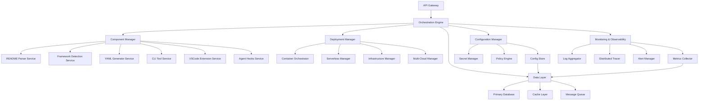

# Integration & Deployment Design Document

## Overview

The Integration & Deployment system serves as the orchestration layer for the entire readme-to-cicd platform, managing component coordination, deployment strategies, and system-wide operations. It provides a comprehensive platform that ensures seamless integration between all components while supporting multiple deployment models, from simple containerized deployments to complex multi-cloud, multi-region enterprise configurations.

The system emphasizes reliability, scalability, and operational excellence through advanced monitoring, automated scaling, comprehensive security controls, and sophisticated deployment orchestration capabilities.

## Architecture

### High-Level Architecture



### Core Components

1. **Orchestration Engine**: Central coordinator managing all system operations and component interactions
2. **Component Manager**: Manages lifecycle and communication between readme-to-cicd components
3. **Deployment Manager**: Handles deployment strategies, rollouts, and infrastructure management
4. **Configuration Manager**: Centralized configuration, secrets, and policy management
5. **Monitoring & Observability**: Comprehensive monitoring, logging, and alerting system
6. **API Gateway**: Unified API access point with authentication, rate limiting, and routing
7. **Data Layer**: Persistent storage, caching, and message queuing infrastructure
8. **Security Manager**: Authentication, authorization, encryption, and compliance management
9. **Analytics Engine**: Usage analytics, performance reporting, and business intelligence
10. **Integration Hub**: Enterprise system integrations and external API management

## Components and Interfaces

### 1. Orchestration Engine Interface

```typescript
interface OrchestrationEngine {
  processWorkflow(request: WorkflowRequest): Promise<WorkflowResult>
  manageComponents(operation: ComponentOperation): Promise<OperationResult>
  coordinateDeployment(deployment: DeploymentConfig): Promise<DeploymentResult>
  handleSystemEvent(event: SystemEvent): Promise<void>
}

interface WorkflowRequest {
  type: 'readme-to-cicd' | 'component-update' | 'system-maintenance'
  payload: any
  context: RequestContext
  priority: 'low' | 'normal' | 'high' | 'critical'
}

interface WorkflowResult {
  success: boolean
  data: any
  metrics: PerformanceMetrics
  traceId: string
}
```

### 2. Component Management System

```typescript
interface ComponentManager {
  registerComponent(component: ComponentDefinition): Promise<void>
  deployComponent(componentId: string, config: DeploymentConfig): Promise<DeploymentResult>
  scaleComponent(componentId: string, scaling: ScalingConfig): Promise<void>
  healthCheck(componentId: string): Promise<HealthStatus>
  updateComponent(componentId: string, update: ComponentUpdate): Promise<void>
}

interface ComponentDefinition {
  id: string
  name: string
  version: string
  type: 'service' | 'function' | 'worker' | 'extension'
  dependencies: string[]
  resources: ResourceRequirements
  healthCheck: HealthCheckConfig
  scaling: ScalingPolicy
}

interface ComponentCommunication {
  messageQueue: MessageQueueConfig
  eventBus: EventBusConfig
  apiGateway: APIGatewayConfig
  serviceDiscovery: ServiceDiscoveryConfig
}
```

### 3. Deployment Management System

```typescript
interface DeploymentManager {
  createDeployment(config: DeploymentConfig): Promise<DeploymentResult>
  updateDeployment(deploymentId: string, update: DeploymentUpdate): Promise<void>
  rollbackDeployment(deploymentId: string, version: string): Promise<void>
  validateDeployment(deploymentId: string): Promise<ValidationResult>
  getDeploymentStatus(deploymentId: string): Promise<DeploymentStatus>
}

interface DeploymentConfig {
  strategy: 'blue-green' | 'canary' | 'rolling' | 'recreate'
  environment: 'development' | 'staging' | 'production'
  infrastructure: InfrastructureConfig
  components: ComponentDeploymentConfig[]
  validation: ValidationConfig
  rollback: RollbackConfig
}

interface InfrastructureConfig {
  provider: 'aws' | 'azure' | 'gcp' | 'kubernetes' | 'docker' | 'hybrid'
  region: string[]
  networking: NetworkConfig
  security: SecurityConfig
  monitoring: MonitoringConfig
}
```

### 4. Configuration Management System

```typescript
interface ConfigurationManager {
  getConfiguration(key: string, environment?: string): Promise<ConfigValue>
  setConfiguration(key: string, value: ConfigValue, environment?: string): Promise<void>
  validateConfiguration(config: Configuration): Promise<ValidationResult>
  watchConfiguration(key: string, callback: ConfigChangeCallback): Promise<void>
  migrateConfiguration(migration: ConfigMigration): Promise<void>
}

interface Configuration {
  system: SystemConfig
  components: ComponentConfigs
  deployment: DeploymentConfigs
  security: SecurityConfig
  monitoring: MonitoringConfig
  integrations: IntegrationConfigs
}

interface SecretManager {
  storeSecret(key: string, value: string, metadata?: SecretMetadata): Promise<void>
  retrieveSecret(key: string): Promise<string>
  rotateSecret(key: string): Promise<void>
  auditSecrets(): Promise<SecretAuditReport>
}
```

### 5. Monitoring & Observability System

```typescript
interface MonitoringSystem {
  collectMetrics(source: string, metrics: Metric[]): Promise<void>
  queryMetrics(query: MetricQuery): Promise<MetricResult[]>
  createAlert(alert: AlertDefinition): Promise<string>
  sendNotification(notification: Notification): Promise<void>
  generateReport(report: ReportDefinition): Promise<Report>
}

interface ObservabilityStack {
  metrics: MetricsCollector
  logging: LogAggregator
  tracing: DistributedTracer
  alerting: AlertManager
  dashboards: DashboardManager
}

interface MetricsCollector {
  systemMetrics: SystemMetrics
  applicationMetrics: ApplicationMetrics
  businessMetrics: BusinessMetrics
  customMetrics: CustomMetrics
}
```

### 6. Security Management System

```typescript
interface SecurityManager {
  authenticate(credentials: Credentials): Promise<AuthenticationResult>
  authorize(user: User, resource: Resource, action: Action): Promise<boolean>
  encrypt(data: string, context?: EncryptionContext): Promise<string>
  decrypt(encryptedData: string, context?: EncryptionContext): Promise<string>
  auditLog(event: AuditEvent): Promise<void>
}

interface ComplianceManager {
  validateCompliance(framework: ComplianceFramework): Promise<ComplianceReport>
  enforcePolicy(policy: Policy): Promise<PolicyResult>
  generateAuditReport(timeRange: TimeRange): Promise<AuditReport>
  trackRisk(risk: RiskAssessment): Promise<void>
}

interface SecurityConfig {
  authentication: AuthConfig
  authorization: AuthzConfig
  encryption: EncryptionConfig
  compliance: ComplianceConfig
  audit: AuditConfig
}
```

## Data Models

### System Architecture Model

The Integration & Deployment system uses a layered architecture approach:

1. **API Layer**: Unified API gateway with authentication, rate limiting, and routing
2. **Orchestration Layer**: Central coordination and workflow management
3. **Service Layer**: Component management, deployment, and configuration services
4. **Infrastructure Layer**: Container orchestration, serverless, and cloud management
5. **Data Layer**: Persistent storage, caching, and message queuing
6. **Monitoring Layer**: Comprehensive observability and alerting
7. **Security Layer**: Authentication, authorization, and compliance management

### Deployment Strategies Model

```typescript
interface DeploymentStrategy {
  type: 'blue-green' | 'canary' | 'rolling' | 'recreate'
  configuration: StrategyConfig
  validation: ValidationSteps[]
  rollback: RollbackPolicy
}

interface BlueGreenStrategy extends DeploymentStrategy {
  switchTraffic: TrafficSwitchConfig
  environmentValidation: ValidationConfig
  rollbackTriggers: RollbackTrigger[]
}

interface CanaryStrategy extends DeploymentStrategy {
  stages: CanaryStage[]
  metrics: MetricThreshold[]
  progressionRules: ProgressionRule[]
}

interface RollingStrategy extends DeploymentStrategy {
  batchSize: number | string
  maxUnavailable: number | string
  progressDeadline: number
}
```

### Multi-Cloud Infrastructure Model

```typescript
interface MultiCloudConfig {
  primary: CloudProvider
  secondary: CloudProvider[]
  failover: FailoverConfig
  dataReplication: ReplicationConfig
  networkConnectivity: NetworkConfig
}

interface CloudProvider {
  type: 'aws' | 'azure' | 'gcp' | 'kubernetes'
  regions: string[]
  services: CloudService[]
  credentials: CredentialConfig
  networking: NetworkConfig
}

interface HybridDeployment {
  onPremise: OnPremiseConfig
  cloud: CloudConfig[]
  connectivity: HybridNetworkConfig
  dataSync: DataSyncConfig
}
```

## Error Handling

### System-Wide Error Management

1. **Circuit Breaker Pattern**: Prevent cascading failures across components
2. **Retry Mechanisms**: Intelligent retry with exponential backoff
3. **Graceful Degradation**: Maintain core functionality during partial failures
4. **Error Aggregation**: Centralized error collection and analysis
5. **Recovery Procedures**: Automated recovery and manual intervention procedures

### Error Categories

```typescript
interface SystemError {
  type: 'component' | 'deployment' | 'configuration' | 'infrastructure' | 'security'
  severity: 'low' | 'medium' | 'high' | 'critical'
  component: string
  message: string
  context: ErrorContext
  recovery: RecoveryAction[]
}

interface ErrorHandlingStrategy {
  detection: ErrorDetection
  classification: ErrorClassification
  response: ErrorResponse
  recovery: RecoveryProcedure
  prevention: PreventionMeasure[]
}
```

## Testing Strategy

### Comprehensive Testing Framework

1. **Unit Testing**: Individual component testing with mocks and stubs
2. **Integration Testing**: Component interaction and API contract testing
3. **End-to-End Testing**: Complete workflow testing across all components
4. **Performance Testing**: Load testing, stress testing, and scalability validation
5. **Chaos Engineering**: Fault injection and resilience testing
6. **Security Testing**: Penetration testing and vulnerability assessment
7. **Compliance Testing**: Regulatory and policy compliance validation

### Testing Infrastructure

```typescript
interface TestingFramework {
  unitTests: UnitTestSuite
  integrationTests: IntegrationTestSuite
  e2eTests: E2ETestSuite
  performanceTests: PerformanceTestSuite
  chaosTests: ChaosTestSuite
  securityTests: SecurityTestSuite
}

interface TestEnvironment {
  isolation: IsolationConfig
  dataManagement: TestDataConfig
  monitoring: TestMonitoringConfig
  cleanup: CleanupConfig
}
```

## Implementation Notes

### Technology Stack

#### Core Infrastructure
- **Container Orchestration**: Kubernetes, Docker Swarm
- **Service Mesh**: Istio, Linkerd for service communication
- **API Gateway**: Kong, Ambassador, AWS API Gateway
- **Message Queue**: Apache Kafka, RabbitMQ, AWS SQS
- **Database**: PostgreSQL, MongoDB, Redis
- **Monitoring**: Prometheus, Grafana, Jaeger, ELK Stack

#### Cloud Platforms
- **AWS**: EKS, Lambda, RDS, CloudFormation
- **Azure**: AKS, Functions, CosmosDB, ARM Templates
- **GCP**: GKE, Cloud Functions, Firestore, Deployment Manager
- **Multi-Cloud**: Terraform, Pulumi for infrastructure as code

#### Security & Compliance
- **Authentication**: OAuth 2.0, SAML, OpenID Connect
- **Secret Management**: HashiCorp Vault, AWS Secrets Manager
- **Compliance**: Open Policy Agent (OPA), Falco
- **Encryption**: TLS 1.3, AES-256, RSA-4096

### Performance Considerations

1. **Horizontal Scaling**: Auto-scaling based on metrics and demand
2. **Caching Strategy**: Multi-level caching with Redis and CDN
3. **Database Optimization**: Read replicas, connection pooling, query optimization
4. **Network Optimization**: Service mesh, load balancing, CDN integration
5. **Resource Management**: CPU and memory limits, resource quotas

### Security Architecture

```typescript
interface SecurityArchitecture {
  networkSecurity: NetworkSecurityConfig
  applicationSecurity: AppSecurityConfig
  dataSecurity: DataSecurityConfig
  identityManagement: IdentityConfig
  complianceFramework: ComplianceConfig
}

interface ZeroTrustModel {
  identityVerification: IdentityVerificationConfig
  deviceTrust: DeviceTrustConfig
  networkSegmentation: NetworkSegmentationConfig
  dataProtection: DataProtectionConfig
  continuousMonitoring: MonitoringConfig
}
```

### Disaster Recovery Architecture

```typescript
interface DisasterRecoveryPlan {
  backupStrategy: BackupConfig
  replicationStrategy: ReplicationConfig
  failoverProcedure: FailoverConfig
  recoveryTesting: RecoveryTestConfig
  businessContinuity: ContinuityConfig
}

interface HighAvailabilityConfig {
  multiRegion: MultiRegionConfig
  loadBalancing: LoadBalancingConfig
  healthChecking: HealthCheckConfig
  automaticFailover: FailoverConfig
  dataConsistency: ConsistencyConfig
}
```

### Analytics and Reporting

```typescript
interface AnalyticsEngine {
  usageAnalytics: UsageAnalyticsConfig
  performanceAnalytics: PerformanceAnalyticsConfig
  businessAnalytics: BusinessAnalyticsConfig
  customAnalytics: CustomAnalyticsConfig
}

interface ReportingSystem {
  dashboards: DashboardConfig[]
  scheduledReports: ScheduledReportConfig[]
  alertReports: AlertReportConfig[]
  complianceReports: ComplianceReportConfig[]
}
```

### Enterprise Integration Patterns

```typescript
interface EnterpriseIntegration {
  identityProviders: IdentityProviderConfig[]
  workflowSystems: WorkflowSystemConfig[]
  notificationSystems: NotificationSystemConfig[]
  monitoringSystems: MonitoringSystemConfig[]
  cicdSystems: CICDSystemConfig[]
}

interface APIManagement {
  versionManagement: VersionManagementConfig
  rateLimiting: RateLimitingConfig
  authentication: APIAuthConfig
  documentation: APIDocConfig
  analytics: APIAnalyticsConfig
}
```

### Extensibility and Plugin Architecture

The system supports extensive customization through:

1. **Plugin System**: Custom components and extensions
2. **Webhook Framework**: Event-driven integrations
3. **Custom Metrics**: Business-specific monitoring
4. **Policy Extensions**: Custom compliance and governance rules
5. **Integration Adapters**: Custom enterprise system integrations

### Operational Excellence

```typescript
interface OperationalFramework {
  monitoring: ComprehensiveMonitoring
  alerting: IntelligentAlerting
  automation: OperationalAutomation
  documentation: LivingDocumentation
  training: OperationalTraining
}

interface SiteReliabilityEngineering {
  errorBudgets: ErrorBudgetConfig
  slaManagement: SLAManagementConfig
  incidentResponse: IncidentResponseConfig
  postmortemProcess: PostmortemConfig
  reliabilityTesting: ReliabilityTestConfig
}
```

This comprehensive design provides a robust, scalable, and secure foundation for the Integration & Deployment system, ensuring reliable operation of the entire readme-to-cicd platform across diverse deployment scenarios and enterprise requirements.