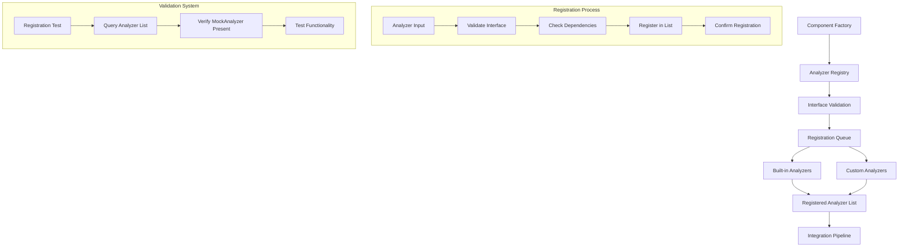

# Design Document

## Overview

This design addresses the critical MockAnalyzer registration failure by implementing a robust analyzer registration system that properly handles both built-in and custom analyzers. The solution focuses on fixing the component factory's analyzer registration mechanism, ensuring proper interface validation, and establishing a reliable plugin system that can be validated through integration tests.

## Architecture

### Analyzer Registration Flow



### Component Integration Architecture

The registration fix establishes a clear flow where:
1. Component Factory receives analyzer configurations (built-in + custom)
2. Analyzer Registry validates each analyzer's interface compliance
3. Registration Queue processes analyzers in dependency order
4. Registered Analyzer List maintains all successfully registered analyzers
5. Integration Pipeline accesses analyzers through the registry
6. Validation System confirms registration success through tests

## Components and Interfaces

### Enhanced Analyzer Registry

```typescript
interface AnalyzerRegistry {
  register(analyzer: AnalyzerInterface, name: string): RegistrationResult;
  registerMultiple(analyzers: AnalyzerConfig[]): RegistrationResult[];
  getRegisteredAnalyzers(): string[];
  getAnalyzer(name: string): AnalyzerInterface | null;
  validateRegistration(): ValidationResult;
  clearRegistry(): void;
}

interface RegistrationResult {
  success: boolean;
  analyzerName: string;
  error?: string;
  validationDetails?: ValidationDetails;
}

interface AnalyzerConfig {
  name: string;
  analyzer: AnalyzerInterface;
  dependencies?: string[];
  priority?: number;
}
```

### Fixed Component Factory

```typescript
interface EnhancedComponentFactory {
  createReadmeParser(config: ParserConfig): ReadmeParser;
  registerCustomAnalyzers(analyzers: AnalyzerConfig[]): RegistrationResult[];
  getAnalyzerRegistry(): AnalyzerRegistry;
  validateComponentSetup(): ComponentValidationResult;
}

interface ParserConfig {
  customAnalyzers?: AnalyzerConfig[];
  enabledAnalyzers?: string[];
  registrationOptions?: RegistrationOptions;
}

interface RegistrationOptions {
  validateInterfaces: boolean;
  allowDuplicates: boolean;
  failOnError: boolean;
  registrationTimeout: number;
}
```

### MockAnalyzer Interface Compliance

```typescript
interface MockAnalyzer extends AnalyzerInterface {
  name: 'MockAnalyzer';
  analyze(content: string): AnalysisResult;
  getCapabilities(): AnalyzerCapabilities;
  validateInterface(): boolean;
  
  // Mock-specific methods for testing
  setMockResult(result: AnalysisResult): void;
  resetMock(): void;
  getCallHistory(): MethodCall[];
}

interface AnalyzerInterface {
  name: string;
  analyze(content: string): AnalysisResult;
  getCapabilities(): AnalyzerCapabilities;
  validateInterface(): boolean;
}
```

### Registration Validation System

```typescript
interface RegistrationValidator {
  validateAnalyzerInterface(analyzer: any): InterfaceValidationResult;
  validateDependencies(analyzer: AnalyzerConfig): DependencyValidationResult;
  validateRegistrationState(): RegistrationStateResult;
  generateValidationReport(): ValidationReport;
}

interface InterfaceValidationResult {
  isValid: boolean;
  missingMethods: string[];
  invalidMethods: string[];
  complianceScore: number;
}
```

## Data Models

### Registration State Model

```typescript
interface RegistrationState {
  registeredAnalyzers: Map<string, AnalyzerInterface>;
  registrationOrder: string[];
  failedRegistrations: RegistrationFailure[];
  registrationTimestamp: Date;
  validationStatus: ValidationStatus;
}

interface RegistrationFailure {
  analyzerName: string;
  error: string;
  timestamp: Date;
  retryCount: number;
}

enum ValidationStatus {
  PENDING = 'pending',
  VALID = 'valid',
  INVALID = 'invalid',
  PARTIAL = 'partial'
}
```

### Test Integration Model

```typescript
interface TestAnalyzerSetup {
  mockAnalyzer: MockAnalyzer;
  expectedAnalyzers: string[];
  registrationConfig: RegistrationOptions;
  validationCriteria: ValidationCriteria;
}

interface ValidationCriteria {
  requiredAnalyzers: string[];
  minimumRegistrationCount: number;
  interfaceComplianceRequired: boolean;
  functionalityTestRequired: boolean;
}
```

## Error Handling

### Registration Error Types

```typescript
class AnalyzerRegistrationError extends Error {
  constructor(
    message: string, 
    public analyzerName: string, 
    public registrationPhase: string
  ) {
    super(`Analyzer registration failed for ${analyzerName} during ${registrationPhase}: ${message}`);
  }
}

class InterfaceValidationError extends Error {
  constructor(
    message: string, 
    public analyzerName: string, 
    public missingMethods: string[]
  ) {
    super(`Interface validation failed for ${analyzerName}: ${message}. Missing: ${missingMethods.join(', ')}`);
  }
}

class RegistrationStateError extends Error {
  constructor(message: string, public currentState: RegistrationState) {
    super(`Registration state error: ${message}`);
  }
}
```

### Error Recovery Strategies

1. **Interface Validation Failures**: Log detailed error and skip analyzer, continue with others
2. **Dependency Resolution Failures**: Attempt to register dependencies first, retry registration
3. **Registration Timeout**: Cancel registration and mark as failed, provide timeout details
4. **Duplicate Registration**: Either skip or replace based on configuration settings
5. **Test Registration Failures**: Provide detailed diagnostics and suggested fixes

## Testing Strategy

### Unit Testing Approach

- **AnalyzerRegistry**: Test registration, retrieval, and validation of individual analyzers
- **ComponentFactory**: Test analyzer configuration and factory method integration
- **MockAnalyzer**: Test interface compliance and mock functionality
- **RegistrationValidator**: Test validation logic with various analyzer configurations

### Integration Testing Approach

- **End-to-End Registration**: Test complete registration flow from factory to pipeline
- **MockAnalyzer Integration**: Specifically test MockAnalyzer registration and functionality
- **Multi-Analyzer Registration**: Test registration of multiple custom analyzers simultaneously
- **Error Scenario Testing**: Test registration failures and recovery mechanisms

### Validation Testing Approach

- **Registration Verification**: Test that registered analyzers appear in analyzer list
- **Interface Compliance**: Test that all registered analyzers implement required interfaces
- **Functionality Validation**: Test that registered analyzers can be called and produce results
- **Performance Testing**: Ensure registration process doesn't impact system performance

## Implementation Details

### Critical Fix Points

1. **Component Factory Enhancement**: Ensure custom analyzers are properly passed to the registry
2. **Registry Implementation**: Fix the registration logic to actually store and retrieve analyzers
3. **Interface Validation**: Implement proper validation to catch registration issues early
4. **Test Integration**: Ensure MockAnalyzer follows the exact same registration path as built-in analyzers

### Registration Process Flow

1. **Initialization**: Component factory receives analyzer configurations
2. **Validation**: Each analyzer is validated for interface compliance
3. **Registration**: Analyzers are registered in the registry with proper naming
4. **Verification**: Registration success is confirmed and logged
5. **Integration**: Registered analyzers are made available to the integration pipeline
6. **Testing**: Integration tests verify all expected analyzers are present and functional