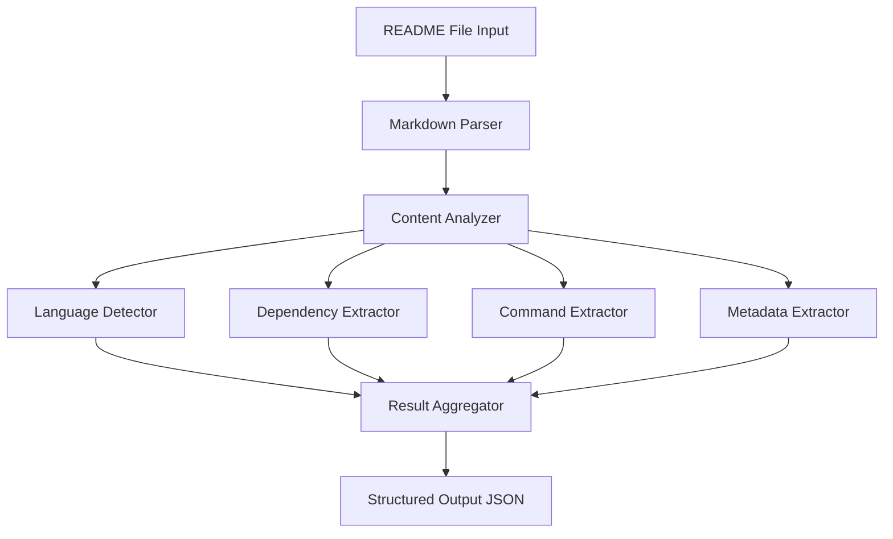

# README Parser Design Document

## Overview

The README Parser is a Node.js module that analyzes README.md files to extract structured project information for CI/CD pipeline generation. It uses a combination of markdown parsing, pattern matching, and natural language processing techniques to identify programming languages, dependencies, build commands, and project metadata.

The parser follows a modular architecture with separate analyzers for different types of information extraction, ensuring maintainability and extensibility for future enhancements.

## Architecture

### High-Level Architecture



### Core Components

1. **File Reader**: Handles README file input and validation
2. **Markdown Parser**: Converts markdown to structured AST using `marked` library
3. **Content Analyzer**: Orchestrates different extraction modules
4. **Language Detector**: Identifies programming languages from code blocks and text
5. **Dependency Extractor**: Finds package files and installation commands
6. **Command Extractor**: Extracts build, test, and execution commands
7. **Metadata Extractor**: Captures project information and structure
8. **Result Aggregator**: Combines results into standardized output format

## Components and Interfaces

### 1. Main Parser Interface

```typescript
interface ReadmeParser {
  parseFile(filePath: string): Promise<ParseResult>
  parseContent(content: string): Promise<ParseResult>
}

interface ParseResult {
  success: boolean
  data?: ProjectInfo
  errors?: ParseError[]
  warnings?: string[]
}
```

### 2. Project Information Schema

```typescript
interface ProjectInfo {
  metadata: ProjectMetadata
  languages: LanguageInfo[]
  dependencies: DependencyInfo
  commands: CommandInfo
  testing: TestingInfo
  confidence: ConfidenceScores
}

interface ProjectMetadata {
  name?: string
  description?: string
  structure?: string[]
  environment?: EnvironmentVariable[]
}

interface LanguageInfo {
  name: string
  confidence: number
  sources: string[] // 'code-block', 'text-mention', 'file-reference'
  frameworks?: string[]
}

interface DependencyInfo {
  packageFiles: PackageFile[]
  installCommands: Command[]
  packages: Package[]
}

interface CommandInfo {
  build: Command[]
  test: Command[]
  run: Command[]
  other: Command[]
}
```

### 3. Analyzer Modules

Each analyzer implements a common interface:

```typescript
interface ContentAnalyzer {
  analyze(ast: MarkdownAST, rawContent: string): AnalysisResult
}

interface AnalysisResult {
  data: any
  confidence: number
  sources: string[]
}
```

## Data Models

### Language Detection Model

The language detector uses multiple detection strategies:

1. **Code Block Analysis**: Extract language identifiers from fenced code blocks
2. **Pattern Matching**: Use regex patterns to identify language-specific syntax
3. **Text Analysis**: Search for language mentions in prose text
4. **File Reference Detection**: Identify language-specific files mentioned

### Dependency Detection Model

Dependency extraction focuses on common package management files:

- **Node.js**: `package.json`, `package-lock.json`, `yarn.lock`
- **Python**: `requirements.txt`, `setup.py`, `Pipfile`, `pyproject.toml`
- **Rust**: `Cargo.toml`, `Cargo.lock`
- **Go**: `go.mod`, `go.sum`
- **Java**: `pom.xml`, `build.gradle`, `build.gradle.kts`
- **PHP**: `composer.json`, `composer.lock`
- **Ruby**: `Gemfile`, `Gemfile.lock`

### Command Extraction Model

Commands are extracted from code blocks using pattern recognition:

```typescript
interface CommandPattern {
  type: 'build' | 'test' | 'run' | 'install'
  patterns: RegExp[]
  languages?: string[]
  confidence: number
}
```

Common command patterns:
- Build: `npm run build`, `cargo build`, `make`, `mvn compile`
- Test: `npm test`, `pytest`, `cargo test`, `go test`
- Install: `npm install`, `pip install`, `cargo install`

## Error Handling

### Error Categories

1. **File System Errors**: File not found, permission denied, read errors
2. **Parse Errors**: Malformed markdown, encoding issues
3. **Analysis Errors**: Pattern matching failures, incomplete extraction
4. **Validation Errors**: Invalid output format, missing required fields

### Error Recovery Strategy

- **Graceful Degradation**: Continue processing even if some analyzers fail
- **Partial Results**: Return successfully extracted information with error details
- **Confidence Scoring**: Lower confidence scores for incomplete or uncertain results
- **Detailed Logging**: Provide specific error messages for debugging

### Error Response Format

```typescript
interface ParseError {
  code: string
  message: string
  component: string
  severity: 'error' | 'warning' | 'info'
  details?: any
}
```

## Testing Strategy

### Unit Testing

- **Individual Analyzers**: Test each analyzer module independently
- **Pattern Matching**: Verify regex patterns against known code samples
- **Edge Cases**: Test with malformed, empty, or unusual README files
- **Mock Data**: Use controlled test inputs for predictable results

### Integration Testing

- **End-to-End Parsing**: Test complete parsing workflow with real README files
- **Cross-Component**: Verify data flow between analyzer modules
- **Error Scenarios**: Test error handling and recovery mechanisms

### Test Data Strategy

1. **Synthetic READMEs**: Create controlled test cases for specific scenarios
2. **Real-World Samples**: Use actual README files from popular GitHub repositories
3. **Edge Cases**: Test with minimal, malformed, and complex README files
4. **Multi-Language**: Test projects with multiple programming languages

### Performance Testing

- **Large Files**: Test with very large README files (>1MB)
- **Complex Parsing**: Test with heavily nested markdown structures
- **Memory Usage**: Monitor memory consumption during parsing
- **Execution Time**: Ensure parsing completes within reasonable time limits

### Test Coverage Goals

- **Code Coverage**: Minimum 90% line coverage
- **Branch Coverage**: Test all conditional logic paths
- **Error Paths**: Verify all error handling scenarios
- **Language Support**: Test detection for all supported programming languages

## Implementation Notes

### Library Dependencies

- **marked**: Fast markdown parser with AST support
- **fs/promises**: Async file system operations
- **path**: File path manipulation utilities

### Performance Considerations

- **Streaming**: Use streaming for large files to reduce memory usage
- **Caching**: Cache parsed AST for multiple analyzer passes
- **Lazy Loading**: Load analyzer modules only when needed
- **Early Exit**: Stop processing when confidence thresholds are met

### Extensibility Design

- **Plugin Architecture**: Allow custom analyzers to be added
- **Configuration**: Support customizable patterns and thresholds
- **Language Packs**: Modular language detection rules
- **Output Formats**: Support multiple output schemas