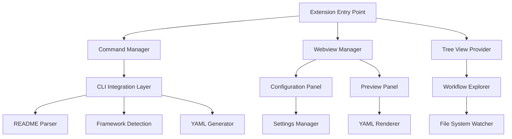

# VS Code Extension Design Document

## Overview

The VS Code Extension component provides integrated development environment support for the readme-to-cicd system through Visual Studio Code's extension API. It offers a rich graphical interface, real-time workflow preview, and seamless integration with VS Code's native features including the Command Palette, file explorer, and source control. The extension is built using TypeScript and leverages VS Code's webview API for complex UI components while maintaining performance and user experience standards.

The extension follows VS Code's design principles and extension guidelines, providing both simple command-based interactions and advanced visual configuration through custom panels and views.

## Architecture

### High-Level Architecture



### Core Components

1. **Extension Entry Point**: Main activation and lifecycle management
2. **Command Manager**: Handles VS Code commands and Command Palette integration
3. **Webview Manager**: Manages custom UI panels and webview communication
4. **Tree View Provider**: Provides custom views in VS Code's sidebar
5. **CLI Integration Layer**: Interfaces with the existing CLI components
6. **Configuration Panel**: Visual interface for workflow generation settings
7. **Preview Panel**: Real-time workflow preview with syntax highlighting
8. **Workflow Explorer**: File explorer integration for workflow management

## Components and Interfaces

### 1. Extension Main Interface

```typescript
interface ReadmeToCICDExtension {
  activate(context: vscode.ExtensionContext): Promise<void>
  deactivate(): Promise<void>
  registerCommands(): void
  registerProviders(): void
  setupFileWatchers(): void
}

interface ExtensionContext {
  subscriptions: vscode.Disposable[]
  workspaceState: vscode.Memento
  globalState: vscode.Memento
  extensionPath: string
}
```

### 2. Command System

```typescript
interface CommandManager {
  registerCommand(command: string, callback: CommandCallback): void
  executeCommand(command: string, ...args: any[]): Promise<any>
  getAvailableCommands(): CommandInfo[]
}

interface CommandCallback {
  (context: CommandContext): Promise<void>
}

interface CommandContext {
  workspaceFolder: vscode.WorkspaceFolder
  activeEditor: vscode.TextEditor
  selection: vscode.Selection
}

// Available Commands
enum ExtensionCommands {
  GENERATE_WORKFLOW = 'readme-to-cicd.generateWorkflow',
  PREVIEW_WORKFLOW = 'readme-to-cicd.previewWorkflow',
  VALIDATE_WORKFLOW = 'readme-to-cicd.validateWorkflow',
  OPEN_CONFIGURATION = 'readme-to-cicd.openConfiguration',
  REFRESH_DETECTION = 'readme-to-cicd.refreshDetection'
}
```

### 3. Webview System

```typescript
interface WebviewManager {
  createConfigurationPanel(): ConfigurationWebview
  createPreviewPanel(): PreviewWebview
  disposeAll(): void
}

interface ConfigurationWebview extends vscode.WebviewPanel {
  updateConfiguration(config: WorkflowConfiguration): void
  onConfigurationChange: vscode.Event<WorkflowConfiguration>
  onGenerateRequest: vscode.Event<GenerationRequest>
}

interface PreviewWebview extends vscode.WebviewPanel {
  updatePreview(workflows: WorkflowFile[]): void
  onApproveGeneration: vscode.Event<ApprovalRequest>
  onEditRequest: vscode.Event<EditRequest>
}
```

### 4. Tree View Integration

```typescript
interface WorkflowTreeProvider implements vscode.TreeDataProvider<WorkflowItem> {
  getTreeItem(element: WorkflowItem): vscode.TreeItem
  getChildren(element?: WorkflowItem): Promise<WorkflowItem[]>
  refresh(): void
  onDidChangeTreeData: vscode.Event<WorkflowItem | undefined>
}

interface WorkflowItem {
  label: string
  type: 'workflow' | 'job' | 'step' | 'framework'
  resourceUri?: vscode.Uri
  command?: vscode.Command
  contextValue: string
}
```

## Data Models

### Configuration Management

```typescript
interface ExtensionConfiguration {
  workspace: WorkspaceConfiguration
  user: UserConfiguration
  organization: OrganizationConfiguration
}

interface WorkspaceConfiguration {
  defaultOutputDirectory: string
  enableAutoGeneration: boolean
  preferredWorkflowTypes: WorkflowType[]
  customTemplates: string[]
  gitIntegration: GitIntegrationSettings
}

interface UserConfiguration {
  showPreviewByDefault: boolean
  enableInlineValidation: boolean
  preferredTheme: 'light' | 'dark' | 'auto'
  notificationLevel: 'all' | 'errors' | 'none'
}
```

### Webview Communication

```typescript
interface WebviewMessage {
  type: MessageType
  payload: any
  requestId?: string
}

enum MessageType {
  CONFIGURATION_UPDATE = 'configurationUpdate',
  GENERATE_REQUEST = 'generateRequest',
  PREVIEW_UPDATE = 'previewUpdate',
  VALIDATION_RESULT = 'validationResult',
  ERROR_NOTIFICATION = 'errorNotification'
}

interface GenerationRequest {
  readmePath: string
  configuration: WorkflowConfiguration
  outputDirectory: string
  previewOnly: boolean
}
```

### File System Integration

```typescript
interface FileSystemManager {
  watchReadmeFiles(): vscode.FileSystemWatcher
  watchWorkflowFiles(): vscode.FileSystemWatcher
  createWorkflowFiles(workflows: WorkflowFile[]): Promise<void>
  validateWorkflowFile(uri: vscode.Uri): Promise<ValidationResult>
}

interface WorkflowFile {
  filename: string
  content: string
  type: WorkflowType
  relativePath: string
}
```

## Error Handling

### Extension Error Categories

1. **Activation Errors**: Extension startup and initialization failures
2. **Command Errors**: Command execution and parameter validation issues
3. **Webview Errors**: UI panel creation and communication failures
4. **File System Errors**: File access, permission, and I/O issues
5. **Integration Errors**: CLI component integration and communication problems

### Error Recovery Strategy

```typescript
interface ErrorHandler {
  handleActivationError(error: Error): void
  handleCommandError(command: string, error: Error): void
  handleWebviewError(panel: string, error: Error): void
  showUserFriendlyError(error: ExtensionError): void
}

interface ExtensionError {
  code: string
  message: string
  category: ErrorCategory
  severity: 'error' | 'warning' | 'info'
  actions: ErrorAction[]
}

interface ErrorAction {
  title: string
  command: string
  arguments?: any[]
}
```

## Testing Strategy

### Unit Testing

- **Command Registration**: Test command registration and execution
- **Webview Communication**: Test message passing between extension and webviews
- **Configuration Management**: Test settings loading and validation
- **File System Operations**: Test file watching and workflow creation

### Integration Testing

- **CLI Integration**: Test integration with README Parser, Framework Detection, and YAML Generator
- **VS Code API**: Test extension API usage and compatibility
- **Webview Functionality**: Test UI panels and user interactions
- **File System Integration**: Test file operations and workspace management

### User Experience Testing

- **Command Discoverability**: Test Command Palette integration and context menus
- **UI Responsiveness**: Test webview performance and user interaction flows
- **Error Handling**: Test error scenarios and user feedback
- **Accessibility**: Test keyboard navigation and screen reader compatibility

## Implementation Notes

### VS Code Extension Structure

```
extension/
├── package.json              # Extension manifest
├── src/
│   ├── extension.ts         # Main entry point
│   ├── commands/            # Command implementations
│   ├── webviews/           # Webview panels and communication
│   ├── providers/          # Tree view and other providers
│   ├── services/           # Business logic and CLI integration
│   └── utils/              # Utility functions and helpers
├── media/                  # Icons, CSS, and static assets
├── webview-ui/            # React/HTML UI for webviews
└── test/                  # Test files and fixtures
```

### Key Dependencies

- **@types/vscode**: VS Code extension API type definitions
- **vscode-test**: Testing framework for VS Code extensions
- **webpack**: Bundling for extension and webview code
- **react**: UI framework for complex webview panels (optional)

### Performance Considerations

- **Lazy Loading**: Load CLI components only when needed
- **Webview Optimization**: Minimize webview creation and memory usage
- **File System Efficiency**: Use VS Code's file system API efficiently
- **Background Processing**: Use VS Code's progress API for long operations

### Security Considerations

- **Webview Security**: Implement proper Content Security Policy for webviews
- **File Access**: Validate file paths and permissions
- **Command Validation**: Sanitize command parameters and user inputs
- **Secret Handling**: Never expose secrets in webview content

### User Experience Design

#### Command Integration

```typescript
// Command Palette integration
{
  "command": "readme-to-cicd.generateWorkflow",
  "title": "Generate CI/CD Workflow",
  "category": "README to CI/CD"
}

// Context menu integration
{
  "command": "readme-to-cicd.generateFromReadme",
  "when": "resourceFilename == README.md",
  "group": "readme-to-cicd"
}
```

#### Webview UI Design

- **Configuration Panel**: Form-based interface with real-time validation
- **Preview Panel**: Split view with configuration on left, preview on right
- **Workflow Explorer**: Tree view showing detected frameworks and generated workflows
- **Status Bar Integration**: Show generation status and quick actions

### Extension Lifecycle

```typescript
interface ExtensionLifecycle {
  activate(context: vscode.ExtensionContext): Promise<void>
  onWorkspaceChange(): void
  onConfigurationChange(): void
  onFileSystemChange(): void
  deactivate(): Promise<void>
}
```

### CLI Integration Strategy

```typescript
interface CLIIntegration {
  executeReadmeParser(readmePath: string): Promise<ProjectInfo>
  executeFrameworkDetection(projectInfo: ProjectInfo): Promise<DetectionResult>
  executeYAMLGeneration(detectionResult: DetectionResult): Promise<WorkflowOutput[]>
  validateWorkflow(workflowPath: string): Promise<ValidationResult>
}
```

### Webview Communication Protocol

```typescript
// Extension to Webview
interface ExtensionToWebviewMessage {
  type: 'configurationUpdate' | 'previewUpdate' | 'validationResult'
  data: any
}

// Webview to Extension
interface WebviewToExtensionMessage {
  type: 'generateRequest' | 'configurationChange' | 'previewApproval'
  data: any
}
```

### Settings Schema

```json
{
  "readme-to-cicd.defaultOutputDirectory": {
    "type": "string",
    "default": ".github/workflows",
    "description": "Default directory for generated workflow files"
  },
  "readme-to-cicd.enableAutoGeneration": {
    "type": "boolean",
    "default": false,
    "description": "Automatically generate workflows when README changes"
  },
  "readme-to-cicd.showPreviewByDefault": {
    "type": "boolean",
    "default": true,
    "description": "Show preview panel before generating workflows"
  }
}
```