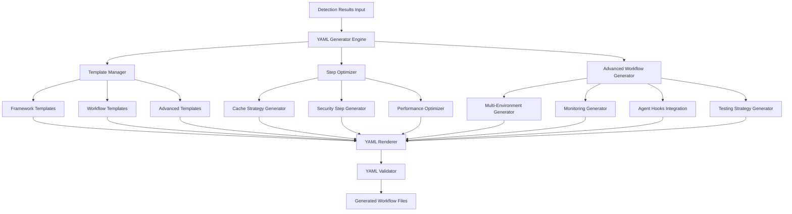

# YAML Generator Design Document

## Overview

The YAML Generator component transforms framework detection results and CI pipeline configurations into valid GitHub Actions workflow files. It uses a template-based approach with intelligent customization to generate optimized, maintainable YAML workflows that follow GitHub Actions best practices. The component serves as the final output stage of the automated CI/CD pipeline generation system.

The generator emphasizes performance optimization through caching strategies, security best practices, and extensible template management for different workflow types and organizational requirements.

## Architecture

### High-Level Architecture



### Core Components

1. **Generator Engine**: Orchestrates the entire YAML generation process
2. **Template Manager**: Manages workflow and step templates for different frameworks
3. **Step Optimizer**: Optimizes workflow steps for performance and efficiency
4. **Advanced Workflow Generator**: Creates complex workflow patterns and strategies
5. **Cache Strategy Generator**: Creates intelligent caching configurations
6. **Security Step Generator**: Adds appropriate security scanning and compliance steps
7. **Multi-Environment Generator**: Creates deployment workflows for multiple environments
8. **Monitoring Generator**: Adds observability and performance monitoring capabilities
9. **Agent Hooks Integration**: Integrates with Agent Hooks for intelligent automation
10. **Testing Strategy Generator**: Creates comprehensive testing workflows
11. **YAML Renderer**: Converts structured data to formatted YAML output
12. **YAML Validator**: Validates generated YAML syntax and GitHub Actions compliance

## Components and Interfaces

### 1. Main Generator Interface

```typescript
interface YAMLGenerator {
  generateWorkflow(detectionResult: DetectionResult, options?: GenerationOptions): Promise<WorkflowOutput>
  generateMultipleWorkflows(detectionResult: DetectionResult, workflowTypes: WorkflowType[]): Promise<WorkflowOutput[]>
  validateWorkflow(yamlContent: string): ValidationResult
}

interface WorkflowOutput {
  filename: string
  content: string
  type: WorkflowType
  metadata: WorkflowMetadata
}

interface GenerationOptions {
  workflowType: WorkflowType
  customTemplates?: TemplateOverrides
  organizationPolicies?: PolicyConfig
  optimizationLevel: 'basic' | 'standard' | 'aggressive'
  includeComments: boolean
  environments?: EnvironmentConfig[]
  monitoringConfig?: MonitoringConfig
  securityLevel: 'basic' | 'standard' | 'enterprise'
  testingStrategy?: TestingStrategyConfig
  agentHooksEnabled?: boolean
}
```

### 2. Template System Schema

```typescript
interface WorkflowTemplate {
  name: string
  type: WorkflowType
  triggers: TriggerConfig
  jobs: JobTemplate[]
  environment?: EnvironmentConfig
  permissions?: PermissionConfig
}

interface JobTemplate {
  name: string
  runsOn: string
  strategy?: MatrixStrategy
  steps: StepTemplate[]
  needs?: string[]
  if?: string
}

interface StepTemplate {
  name: string
  uses?: string
  run?: string
  with?: Record<string, any>
  env?: Record<string, string>
  if?: string
}
```

### 3. Framework-Specific Templates

```typescript
interface FrameworkTemplateRegistry {
  nodejs: NodeJSTemplates
  python: PythonTemplates
  rust: RustTemplates
  go: GoTemplates
  java: JavaTemplates
  docker: DockerTemplates
  frontend: FrontendTemplates
}

interface NodeJSTemplates {
  setup: StepTemplate[]
  build: StepTemplate[]
  test: StepTemplate[]
  deploy: StepTemplate[]
  cache: CacheConfig[]
  performance: PerformanceTestTemplate[]
  security: SecurityScanTemplate[]
}
```

### 4. Advanced Workflow Components

```typescript
interface MultiEnvironmentGenerator {
  generateEnvironmentWorkflows(environments: EnvironmentConfig[]): WorkflowTemplate[]
  createApprovalGates(environment: EnvironmentConfig): StepTemplate[]
  generatePromotionWorkflow(environments: EnvironmentConfig[]): WorkflowTemplate
}

interface MonitoringGenerator {
  generatePerformanceMonitoring(config: MonitoringConfig): StepTemplate[]
  createAlertingWorkflows(alertConfig: AlertConfig): WorkflowTemplate[]
  generateDashboardUpdates(dashboardConfig: DashboardConfig): StepTemplate[]
}

interface AgentHooksIntegration {
  generateWebhookWorkflows(hookConfig: HookConfig): WorkflowTemplate[]
  createAutomationWorkflows(automationConfig: AutomationConfig): WorkflowTemplate[]
  generateOptimizationWorkflows(): WorkflowTemplate[]
}

interface TestingStrategyGenerator {
  generateIntegrationTests(config: IntegrationTestConfig): StepTemplate[]
  createE2ETestWorkflows(e2eConfig: E2ETestConfig): WorkflowTemplate
  generateContractTests(contractConfig: ContractTestConfig): StepTemplate[]
  createChaosEngineeringWorkflows(chaosConfig: ChaosConfig): WorkflowTemplate[]
}
```

### 5. Environment and Security Configuration

```typescript
interface EnvironmentConfig {
  name: string
  type: 'development' | 'staging' | 'production'
  approvalRequired: boolean
  secrets: string[]
  variables: Record<string, string>
  deploymentStrategy: 'rolling' | 'blue-green' | 'canary'
  rollbackEnabled: boolean
}

interface SecurityScanTemplate {
  sast: StepTemplate[]
  dast: StepTemplate[]
  dependencyScanning: StepTemplate[]
  containerScanning: StepTemplate[]
  complianceChecks: StepTemplate[]
  licenseScanning: StepTemplate[]
}

interface MonitoringConfig {
  performanceTracking: boolean
  alerting: AlertConfig
  dashboards: DashboardConfig[]
  slaTracking: SLAConfig
  logAggregation: LogConfig
}
```

## Data Models

### Advanced Workflow Generation Model

The enhanced generator uses a comprehensive multi-stage approach to create workflows:

1. **Template Selection**: Choose appropriate templates based on detected frameworks
2. **Environment Analysis**: Analyze multi-environment deployment requirements
3. **Step Customization**: Customize steps with detected versions, commands, and configurations
4. **Advanced Pattern Application**: Apply monorepo, microservices, and orchestration patterns
5. **Security Enhancement**: Add comprehensive security scanning and compliance steps
6. **Performance Integration**: Include performance monitoring and benchmarking
7. **Testing Strategy**: Apply comprehensive testing patterns (integration, E2E, contract, chaos)
8. **Agent Hooks Integration**: Add intelligent automation and optimization capabilities
9. **Monitoring Integration**: Add observability and alerting capabilities
10. **Optimization**: Apply caching, parallelization, and performance optimizations
11. **Validation**: Ensure YAML syntax and GitHub Actions compliance

### Advanced Workflow Patterns

```typescript
interface WorkflowPattern {
  type: 'monorepo' | 'microservices' | 'feature-flags' | 'canary' | 'orchestration'
  configuration: PatternConfig
  templates: WorkflowTemplate[]
}

interface MonorepoPattern extends WorkflowPattern {
  pathTriggers: PathTriggerConfig[]
  selectiveBuilds: SelectiveBuildConfig
  dependencyGraph: DependencyGraphConfig
}

interface MicroservicesPattern extends WorkflowPattern {
  services: ServiceConfig[]
  deploymentOrder: string[]
  healthChecks: HealthCheckConfig[]
}

interface CanaryPattern extends WorkflowPattern {
  stages: CanaryStageConfig[]
  metrics: MetricConfig[]
  rollbackTriggers: RollbackTriggerConfig[]
}
```

### Template Hierarchy

```typescript
interface TemplateHierarchy {
  base: BaseWorkflowTemplate // Common structure for all workflows
  language: LanguageTemplate // Language-specific customizations
  framework: FrameworkTemplate // Framework-specific steps
  organization: OrganizationTemplate // Company/team policies
  project: ProjectTemplate // Project-specific overrides
}
```
### 
Caching Strategy Model

Based on research, the generator implements intelligent caching strategies:

```typescript
interface CacheStrategy {
  type: 'dependencies' | 'build' | 'docker' | 'custom'
  paths: string[]
  key: string
  restoreKeys: string[]
  conditions?: string[]
}

interface CacheTemplates {
  nodejs: {
    npm: CacheStrategy
    yarn: CacheStrategy
    pnpm: CacheStrategy
  }
  python: {
    pip: CacheStrategy
    poetry: CacheStrategy
    pipenv: CacheStrategy
  }
  rust: {
    cargo: CacheStrategy
  }
  go: {
    modules: CacheStrategy
  }
  java: {
    maven: CacheStrategy
    gradle: CacheStrategy
  }
  docker: {
    layers: CacheStrategy
    buildx: CacheStrategy
  }
}
```

## Error Handling

### YAML Generation Error Categories

1. **Template Errors**: Missing or invalid templates for detected frameworks
2. **Syntax Errors**: Invalid YAML syntax in generated output
3. **Validation Errors**: GitHub Actions schema violations
4. **Customization Errors**: Invalid template overrides or organization policies
5. **Dependency Errors**: Missing required actions or incompatible versions

### Validation Strategy

```typescript
interface ValidationResult {
  isValid: boolean
  errors: ValidationError[]
  warnings: ValidationWarning[]
  suggestions: string[]
}

interface ValidationError {
  type: 'syntax' | 'schema' | 'action' | 'security'
  message: string
  line?: number
  column?: number
  severity: 'error' | 'warning'
}
```

### Error Recovery

- **Template Fallbacks**: Use generic templates when framework-specific ones fail
- **Partial Generation**: Generate valid workflows even if some optimizations fail
- **Validation Feedback**: Provide specific error messages with line numbers
- **Suggestion Engine**: Offer fixes for common validation errors

## Testing Strategy

### Unit Testing

- **Template Rendering**: Test template compilation with various input combinations
- **YAML Validation**: Verify generated YAML syntax and GitHub Actions compliance
- **Cache Strategy**: Test caching configurations for different frameworks
- **Security Steps**: Verify security scanning steps are properly included

### Integration Testing

- **End-to-End Generation**: Test complete workflow generation from detection results
- **Multi-Framework**: Test projects with multiple detected frameworks
- **Custom Templates**: Test template override and customization functionality
- **Real Workflows**: Validate generated workflows can run successfully in GitHub Actions

### Test Data Strategy

1. **Framework Samples**: Create detection results for each supported framework
2. **Complex Projects**: Test multi-language and multi-framework scenarios
3. **Edge Cases**: Test with minimal detection data and conflicting frameworks
4. **Custom Configurations**: Test with various organization policies and overrides

## Implementation Notes

### Library Dependencies

- **yaml**: Modern YAML parser and stringifier with excellent TypeScript support
- **ajv**: JSON schema validation for GitHub Actions workflow validation
- **handlebars**: Template engine for dynamic content generation
- **fs/promises**: Async file system operations for template loading

### Performance Considerations

- **Template Caching**: Cache compiled templates to avoid repeated parsing
- **Lazy Loading**: Load framework templates only when needed
- **Streaming**: Use streaming for large workflow generation
- **Validation Optimization**: Cache validation schemas and reuse validators

### Security Considerations

- **Template Injection**: Sanitize all user inputs in template variables
- **Secret Handling**: Ensure secrets are properly referenced, never embedded
- **Action Pinning**: Use specific versions of GitHub Actions for security
- **Permissions**: Generate minimal required permissions for workflows

### Agent Hooks Integration

The YAML Generator integrates with the Agent Hooks system to provide intelligent automation:

```typescript
interface AgentHooksWorkflowGenerator {
  generateWebhookResponseWorkflows(events: GitHubEvent[]): WorkflowTemplate[]
  createPerformanceOptimizationWorkflows(metrics: PerformanceMetrics): WorkflowTemplate[]
  generateAutomatedImprovementWorkflows(analysis: WorkflowAnalysis): WorkflowTemplate[]
  createSecurityResponseWorkflows(vulnerabilities: SecurityAlert[]): WorkflowTemplate[]
}

interface IntelligentAutomation {
  dependencyUpdateWorkflows: WorkflowTemplate[]
  performanceRegressionWorkflows: WorkflowTemplate[]
  securityPatchWorkflows: WorkflowTemplate[]
  workflowOptimizationWorkflows: WorkflowTemplate[]
}
```

#### Webhook-Triggered Workflows

- **README Change Detection**: Automatically regenerate CI/CD workflows when README.md changes
- **Performance Regression**: Create workflows that respond to performance degradation
- **Security Alerts**: Generate workflows that automatically address security vulnerabilities
- **Dependency Updates**: Create workflows that test and validate dependency updates

#### Intelligent Optimization

- **Workflow Performance Analysis**: Generate workflows that analyze and optimize pipeline performance
- **Resource Usage Optimization**: Create workflows that optimize compute resource usage
- **Cost Optimization**: Generate workflows that minimize CI/CD costs through intelligent scheduling
- **Failure Pattern Analysis**: Create workflows that learn from failures and improve reliability

### Multi-Environment Deployment Architecture

```typescript
interface EnvironmentOrchestrator {
  generatePromotionPipeline(environments: EnvironmentConfig[]): WorkflowTemplate
  createApprovalWorkflows(approvals: ApprovalConfig[]): WorkflowTemplate[]
  generateRollbackWorkflows(rollbackConfig: RollbackConfig): WorkflowTemplate[]
  createEnvironmentSyncWorkflows(syncConfig: SyncConfig): WorkflowTemplate[]
}

interface DeploymentStrategy {
  rolling: RollingDeploymentConfig
  blueGreen: BlueGreenDeploymentConfig
  canary: CanaryDeploymentConfig
  featureFlags: FeatureFlagDeploymentConfig
}
```

### Extensibility Design

- **Plugin Architecture**: Allow custom template providers and validators
- **Hook System**: Support pre/post generation hooks for customization
- **Schema Extensions**: Support custom workflow schema extensions
- **Template Inheritance**: Allow template composition and inheritance
- **Agent Hooks Integration**: Seamless integration with intelligent automation system
- **Pattern Extensions**: Support for custom workflow patterns and strategies

### YAML Generation Best Practices

#### Template Structure

```yaml
# Example generated workflow structure
name: CI/CD Pipeline
on:
  push:
    branches: [main, develop]
  pull_request:
    branches: [main]

permissions:
  contents: read
  security-events: write

jobs:
  test:
    runs-on: ubuntu-latest
    strategy:
      matrix:
        node-version: [18, 20]
    steps:
      - uses: actions/checkout@v4
      - name: Setup Node.js
        uses: actions/setup-node@v4
        with:
          node-version: ${{ matrix.node-version }}
          cache: 'npm'
      - name: Install dependencies
        run: npm ci
      - name: Run tests
        run: npm test
```

#### Optimization Patterns

- **Matrix Strategies**: Generate matrix builds for multiple versions/platforms
- **Job Dependencies**: Optimize job ordering and parallelization
- **Conditional Execution**: Add smart conditions to skip unnecessary steps
- **Artifact Sharing**: Efficiently share build artifacts between jobs

#### Advanced Security Integration

- **SAST/DAST Scanning**: Include comprehensive static and dynamic application security testing
- **Dependency Scanning**: Include Dependabot, Snyk, and custom vulnerability scanning
- **Container Security**: Include container image scanning and runtime security
- **Compliance Frameworks**: Support SOC2, HIPAA, PCI-DSS, and custom compliance requirements
- **License Scanning**: Include license compliance and legal risk assessment
- **Secret Management**: Advanced secret detection and secure handling
- **OIDC Integration**: Support OpenID Connect for cloud deployments
- **Security Gates**: Implement security approval gates and policy enforcement

#### Performance Monitoring Integration

```yaml
# Example performance monitoring workflow
name: Performance Monitoring
on:
  push:
    branches: [main]
  schedule:
    - cron: '0 */6 * * *'

jobs:
  performance-test:
    runs-on: ubuntu-latest
    steps:
      - uses: actions/checkout@v4
      - name: Run Performance Tests
        run: npm run test:performance
      - name: Collect Metrics
        uses: ./.github/actions/collect-metrics
      - name: Compare with Baseline
        uses: ./.github/actions/performance-comparison
      - name: Update Dashboard
        uses: ./.github/actions/update-dashboard
      - name: Alert on Regression
        if: steps.performance-comparison.outputs.regression == 'true'
        uses: ./.github/actions/send-alert
```

#### Advanced Testing Strategies

- **Integration Testing**: Service dependency management and API contract testing
- **End-to-End Testing**: Browser automation and full user journey testing
- **Contract Testing**: Consumer-driven contract testing with Pact or similar
- **Chaos Engineering**: Fault injection and resilience testing
- **Performance Testing**: Load testing, stress testing, and performance benchmarking
- **Security Testing**: Penetration testing and security validation
- **Accessibility Testing**: Automated accessibility compliance testing