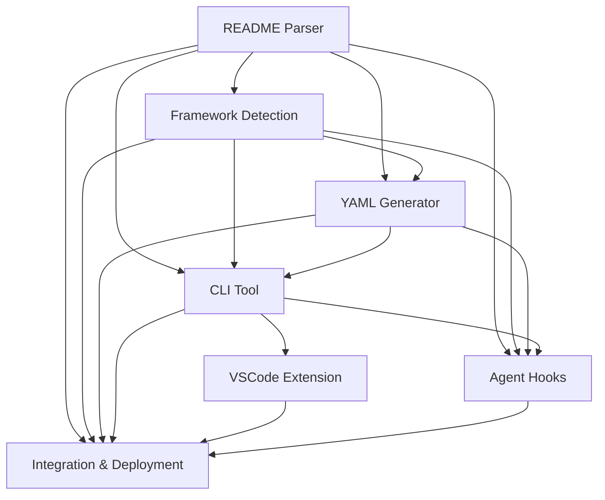

# README-to-CICD Application Plan

## Project Overview

**Project Name**: README-to-CICD  
**Vision**: Automatically generate optimized GitHub Actions CI/CD workflows from README files  
**Mission**: Eliminate manual CI/CD setup by intelligently analyzing project documentation and generating production-ready workflows

## System Architecture

### Core Components (7 Specs)

### 1. README Parser
- **Purpose**: Extract structured information from README files
- **Input**: README.md files
- **Output**: Structured project metadata (dependencies, scripts, frameworks)
- **Key Features**: Markdown parsing, section extraction, dependency detection

### 2. Framework Detection
- **Purpose**: Identify technologies and frameworks from parsed README data
- **Input**: Parsed README structure
- **Output**: Framework identification with versions and configurations
- **Key Features**: Multi-language support, version detection, build tool identification

### 3. YAML Generator (Enhanced)
- **Purpose**: Generate optimized GitHub Actions workflows
- **Input**: Framework detection results
- **Output**: Production-ready YAML workflow files
- **Key Features**: Multi-environment deployment, security scanning, performance monitoring, Agent Hooks integration

### 4. CLI Tool
- **Purpose**: Command-line interface for the entire system
- **Input**: README files or project directories
- **Output**: Generated workflows and system management
- **Key Features**: Interactive mode, batch processing, configuration management

### 5. VSCode Extension
- **Purpose**: IDE integration for seamless developer experience
- **Input**: Workspace projects
- **Output**: In-editor workflow generation and management
- **Key Features**: Real-time preview, one-click generation, workflow validation

### 6. Agent Hooks
- **Purpose**: Intelligent automation and workflow optimization
- **Input**: Repository events and performance data
- **Output**: Automated improvements and optimizations
- **Key Features**: GitHub webhook integration, performance monitoring, automated PR creation

### 7. Integration & Deployment
- **Purpose**: System orchestration and production deployment
- **Input**: All system components
- **Output**: Deployed, monitored, and managed system
- **Key Features**: Multi-cloud deployment, monitoring, security, compliance

## Implementation Strategy

### Phase 1: Core Data Pipeline (Months 1-3)
1. **README Parser** (Month 1)
   - Markdown parsing engine
   - Section extraction algorithms
   - Dependency detection logic
   - Output format standardization

2. **Framework Detection** (Month 2)
   - Framework identification algorithms
   - Version detection systems
   - Build tool recognition
   - Configuration extraction

3. **YAML Generator** (Month 3)
   - Basic workflow templates
   - Framework-specific generators
   - Advanced features (security, monitoring)
   - Template customization system

### Phase 2: User Interfaces (Months 4-5)
4. **CLI Tool** (Month 4)
   - Command-line interface
   - Interactive workflows
   - Configuration management
   - Batch processing capabilities

5. **VSCode Extension** (Month 5)
   - IDE integration
   - Real-time preview
   - Workflow validation
   - User experience optimization

### Phase 3: Advanced Automation (Month 6)
6. **Agent Hooks** (Month 6)
   - GitHub webhook integration
   - Performance monitoring
   - Automated optimization
   - Intelligent PR creation

### Phase 4: Production System (Months 7-8)
7. **Integration & Deployment** (Months 7-8)
   - System orchestration
   - Multi-cloud deployment
   - Monitoring and observability
   - Security and compliance

## Technology Stack

### Core Technologies
- **Language**: TypeScript/Node.js
- **Parsing**: Unified (Markdown), AST manipulation
- **YAML**: js-yaml, Handlebars templating
- **CLI**: Commander.js, Inquirer.js
- **VSCode**: VSCode Extension API

### Infrastructure
- **Containerization**: Docker, Kubernetes
- **Cloud Platforms**: AWS, Azure, GCP
- **Monitoring**: Prometheus, Grafana, ELK Stack
- **Security**: OAuth 2.0, HashiCorp Vault
- **CI/CD**: GitHub Actions, Jenkins integration

### Databases
- **Primary**: PostgreSQL
- **Cache**: Redis
- **Document**: MongoDB (for configurations)
- **Message Queue**: Apache Kafka

## Key Features

### Intelligent Workflow Generation
- **Multi-Framework Support**: Node.js, Python, Rust, Go, Java, Docker
- **Advanced Patterns**: Monorepo, microservices, canary deployments
- **Security Integration**: SAST, DAST, dependency scanning, compliance
- **Performance Optimization**: Caching, parallelization, resource optimization

### Enterprise Capabilities
- **Multi-Environment**: Development, staging, production workflows
- **Compliance**: SOC2, HIPAA, PCI-DSS support
- **Integration**: LDAP, SSO, enterprise workflow systems
- **Monitoring**: Comprehensive observability and alerting

### Developer Experience
- **Zero Configuration**: Works out of the box with sensible defaults
- **Customizable**: Extensive template and policy customization
- **Interactive**: Real-time feedback and validation
- **Intelligent**: Learns from usage patterns and optimizes over time

## Success Metrics

### Technical Metrics
- **Accuracy**: >95% correct framework detection
- **Performance**: <2 seconds workflow generation
- **Reliability**: 99.9% uptime for production system
- **Security**: Zero critical vulnerabilities

### Business Metrics
- **Adoption**: 10,000+ active users in first year
- **Time Savings**: 80% reduction in CI/CD setup time
- **User Satisfaction**: >4.5/5 rating
- **Enterprise Adoption**: 100+ enterprise customers

## Risk Management

### Technical Risks
- **Complexity**: Mitigated by modular architecture and comprehensive testing
- **Performance**: Addressed through caching, optimization, and scalable infrastructure
- **Security**: Managed through security-first design and regular audits
- **Compatibility**: Handled through extensive framework testing and version support

### Business Risks
- **Market Competition**: Differentiated through intelligent automation and enterprise features
- **User Adoption**: Addressed through excellent developer experience and community building
- **Scalability**: Managed through cloud-native architecture and auto-scaling

## Quality Assurance

### Testing Strategy
- **Unit Testing**: >90% code coverage
- **Integration Testing**: End-to-end workflow validation
- **Performance Testing**: Load testing and scalability validation
- **Security Testing**: Penetration testing and vulnerability scanning
- **Chaos Engineering**: Fault injection and resilience testing

### Deployment Strategy
- **Blue-Green Deployments**: Zero-downtime updates
- **Canary Releases**: Gradual rollout with monitoring
- **Automated Rollback**: Immediate recovery from failures
- **Multi-Region**: High availability and disaster recovery

## Future Roadmap

### Year 1: Foundation
- Complete all 7 core components
- Achieve production readiness
- Build initial user base
- Establish enterprise partnerships

### Year 2: Enhancement
- AI-powered workflow optimization
- Advanced analytics and insights
- Extended framework support
- Mobile and web interfaces

### Year 3: Ecosystem
- Plugin marketplace
- Third-party integrations
- API ecosystem
- Community contributions

## Resource Requirements

### Development Team
- **Backend Engineers**: 3-4 developers
- **Frontend Engineers**: 2 developers
- **DevOps Engineers**: 2 engineers
- **Security Engineer**: 1 engineer
- **Product Manager**: 1 manager
- **QA Engineers**: 2 testers

### Infrastructure
- **Development**: $2,000/month
- **Staging**: $5,000/month
- **Production**: $15,000/month (scales with usage)
- **Monitoring & Security**: $3,000/month

### Timeline
- **Total Duration**: 8 months for MVP
- **Beta Release**: Month 6
- **Production Release**: Month 8
- **Enterprise Features**: Month 10

This comprehensive plan provides the roadmap for building a production-ready, enterprise-grade README-to-CICD system that revolutionizes how developers set up and manage CI/CD workflows.