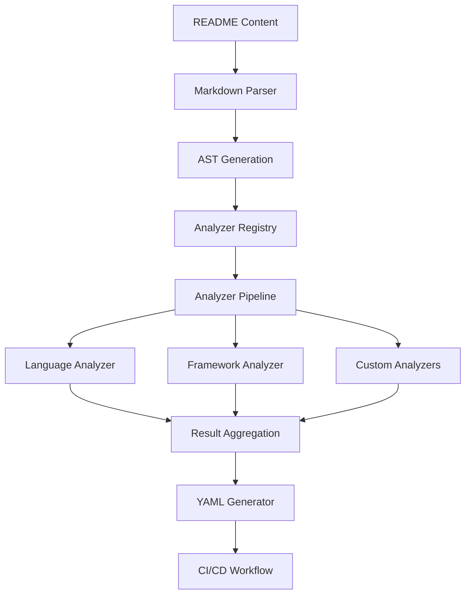

# Custom Analyzer Developer Guide

## Overview

This guide provides comprehensive information for developers who want to extend the README-to-CICD system with custom analyzers. It covers architecture patterns, best practices, advanced features, and integration strategies.

## System Architecture

### Analyzer Pipeline Architecture



### Component Relationships

The analyzer system follows a modular architecture where:

1. **Registry** manages analyzer lifecycle and dependencies
2. **Pipeline** orchestrates analysis execution
3. **Analyzers** perform specific content analysis
4. **Aggregator** combines results for downstream processing

## Analyzer Design Patterns

### 1. Single Responsibility Pattern

Each analyzer should focus on one specific aspect of content analysis:

```typescript
// ✓ Good: Focused on language detection
export class LanguageDetectionAnalyzer implements AnalyzerInterface<LanguageInfo> {
  readonly name = 'LanguageDetectionAnalyzer';
  
  async analyze(ast: MarkdownAST, content: string): Promise<AnalyzerResult<LanguageInfo>> {
    // Only language detection logic
    return this.detectLanguages(content);
  }
}

// ✗ Bad: Multiple responsibilities
export class LanguageAndFrameworkAnalyzer implements AnalyzerInterface {
  async analyze(ast: MarkdownAST, content: string): Promise<AnalyzerResult> {
    // Language detection + framework detection + dependency analysis
    // Too many responsibilities!
  }
}
```

### 2. Strategy Pattern for Analysis Rules

Use strategy pattern for configurable analysis behavior:

```typescript
interface AnalysisStrategy<T> {
  analyze(content: string, ast: MarkdownAST): T;
  getConfidence(result: T): number;
}

export class ConfigurableAnalyzer<T> implements AnalyzerInterface<T> {
  readonly name: string;
  private strategies: AnalysisStrategy<T>[];

  constructor(name: string, strategies: AnalysisStrategy<T>[]) {
    this.name = name;
    this.strategies = strategies;
  }

  async analyze(ast: MarkdownAST, content: string): Promise<AnalyzerResult<T>> {
    const results: T[] = [];
    let totalConfidence = 0;

    for (const strategy of this.strategies) {
      try {
        const result = strategy.analyze(content, ast);
        const confidence = strategy.getConfidence(result);
        
        results.push(result);
        totalConfidence += confidence;
      } catch (error) {
        // Handle strategy failures gracefully
        console.warn(`Strategy failed: ${error}`);
      }
    }

    return {
      success: results.length > 0,
      data: this.combineResults(results),
      confidence: results.length > 0 ? totalConfidence / results.length : 0
    };
  }

  private combineResults(results: T[]): T {
    // Combine strategy results
    return results[0]; // Simplified
  }
}
```

### 3. Chain of Responsibility for Processing

Use chain pattern for multi-step analysis:

```typescript
abstract class AnalysisHandler {
  protected nextHandler?: AnalysisHandler;

  setNext(handler: AnalysisHandler): AnalysisHandler {
    this.nextHandler = handler;
    return handler;
  }

  async handle(context: AnalysisContext): Promise<AnalysisContext> {
    const result = await this.process(context);
    
    if (this.nextHandler) {
      return this.nextHandler.handle(result);
    }
    
    return result;
  }

  protected abstract process(context: AnalysisContext): Promise<AnalysisContext>;
}

export class ChainedAnalyzer implements AnalyzerInterface<any> {
  readonly name = 'ChainedAnalyzer';
  private handlerChain: AnalysisHandler;

  constructor(handlers: AnalysisHandler[]) {
    // Build handler chain
    this.handlerChain = handlers[0];
    for (let i = 0; i < handlers.length - 1; i++) {
      handlers[i].setNext(handlers[i + 1]);
    }
  }

  async analyze(ast: MarkdownAST, content: string): Promise<AnalyzerResult<any>> {
    const context: AnalysisContext = {
      ast,
      content,
      results: new Map()
    };

    try {
      const finalContext = await this.handlerChain.handle(context);
      
      return {
        success: true,
        data: Object.fromEntries(finalContext.results),
        confidence: this.calculateOverallConfidence(finalContext)
      };
    } catch (error) {
      return {
        success: false,
        confidence: 0,
        errors: [{
          code: 'CHAIN_PROCESSING_ERROR',
          message: `Chain processing failed: ${error instanceof Error ? error.message : String(error)}`,
          component: this.name,
          severity: 'error'
        }]
      };
    }
  }
}
```

## Advanced Analyzer Features

### 1. Context-Aware Analysis

Leverage analysis context for enhanced results:

```typescript
export class ContextAwareAnalyzer implements AnalyzerInterface<ContextualResult> {
  readonly name = 'ContextAwareAnalyzer';

  async analyze(
    ast: MarkdownAST, 
    content: string, 
    context?: AnalysisContext
  ): Promise<AnalyzerResult<ContextualResult>> {
    
    // Use context information if available
    const projectInfo = context?.projectInfo;
    const previousResults = context?.previousResults;
    const fileSystemAccess = context?.fileSystemAccess;

    let analysisResult: ContextualResult = {
      baseAnalysis: this.performBaseAnalysis(content, ast)
    };

    // Enhance with context
    if (projectInfo) {
      analysisResult.projectContext = this.analyzeProjectContext(projectInfo);
    }

    if (previousResults) {
      analysisResult.crossAnalysis = this.performCrossAnalysis(previousResults);
    }

    if (fileSystemAccess) {
      analysisResult.fileSystemAnalysis = await this.analyzeFileSystem(fileSystemAccess);
    }

    return {
      success: true,
      data: analysisResult,
      confidence: this.calculateContextualConfidence(analysisResult, context)
    };
  }

  getCapabilities(): AnalyzerCapabilities {
    return {
      supportedContentTypes: ['text/markdown'],
      requiresContext: true, // Indicates context dependency
      canProcessLargeFiles: true,
      estimatedProcessingTime: 300,
      dependencies: []
    };
  }
}
```

### 2. Streaming Analysis for Large Files

Handle large files efficiently:

```typescript
export class StreamingAnalyzer implements AnalyzerInterface<StreamingResult> {
  readonly name = 'StreamingAnalyzer';
  private chunkSize = 1024 * 1024; // 1MB chunks

  async analyze(ast: MarkdownAST, content: string): Promise<AnalyzerResult<StreamingResult>> {
    if (content.length <= this.chunkSize) {
      // Small file - process normally
      return this.processSmallFile(ast, content);
    }

    // Large file - process in chunks
    return this.processLargeFile(ast, content);
  }

  private async processLargeFile(ast: MarkdownAST, content: string): Promise<AnalyzerResult<StreamingResult>> {
    const chunks = this.createChunks(content);
    const chunkResults: ChunkResult[] = [];
    
    for (let i = 0; i < chunks.length; i++) {
      const chunk = chunks[i];
      
      try {
        const chunkResult = await this.processChunk(chunk, i, chunks.length);
        chunkResults.push(chunkResult);
        
        // Yield control periodically to prevent blocking
        if (i % 10 === 0) {
          await new Promise(resolve => setImmediate(resolve));
        }
      } catch (error) {
        console.warn(`Chunk ${i} processing failed:`, error);
        // Continue with other chunks
      }
    }

    return {
      success: chunkResults.length > 0,
      data: {
        totalChunks: chunks.length,
        processedChunks: chunkResults.length,
        results: this.aggregateChunkResults(chunkResults)
      },
      confidence: chunkResults.length / chunks.length
    };
  }

  getCapabilities(): AnalyzerCapabilities {
    return {
      supportedContentTypes: ['text/markdown'],
      requiresContext: false,
      canProcessLargeFiles: true, // Explicitly supports large files
      estimatedProcessingTime: 1000, // Higher for streaming
      dependencies: []
    };
  }
}
```

### 3. Caching and Memoization

Implement intelligent caching:

```typescript
export class CachedAnalyzer implements AnalyzerInterface<CachedResult> {
  readonly name = 'CachedAnalyzer';
  private cache = new Map<string, AnalyzerResult<CachedResult>>();
  private cacheTimeout = 5 * 60 * 1000; // 5 minutes

  async analyze(ast: MarkdownAST, content: string): Promise<AnalyzerResult<CachedResult>> {
    // Create cache key from content hash
    const cacheKey = this.createCacheKey(content);
    
    // Check cache first
    const cached = this.getCachedResult(cacheKey);
    if (cached) {
      return {
        ...cached,
        data: {
          ...cached.data,
          fromCache: true,
          cacheHit: true
        }
      };
    }

    // Perform analysis
    const result = await this.performAnalysis(ast, content);
    
    // Cache result
    this.setCachedResult(cacheKey, result);
    
    return {
      ...result,
      data: {
        ...result.data,
        fromCache: false,
        cacheHit: false
      }
    };
  }

  private createCacheKey(content: string): string {
    // Simple hash function (use crypto.createHash in production)
    let hash = 0;
    for (let i = 0; i < content.length; i++) {
      const char = content.charCodeAt(i);
      hash = ((hash << 5) - hash) + char;
      hash = hash & hash; // Convert to 32-bit integer
    }
    return hash.toString();
  }

  private getCachedResult(key: string): AnalyzerResult<CachedResult> | null {
    const cached = this.cache.get(key);
    if (!cached) return null;

    // Check if cache entry is still valid
    const now = Date.now();
    const cacheTime = cached.data?.cacheTimestamp || 0;
    
    if (now - cacheTime > this.cacheTimeout) {
      this.cache.delete(key);
      return null;
    }

    return cached;
  }

  private setCachedResult(key: string, result: AnalyzerResult<CachedResult>): void {
    const cachedResult = {
      ...result,
      data: {
        ...result.data,
        cacheTimestamp: Date.now()
      }
    };
    
    this.cache.set(key, cachedResult);
    
    // Implement cache size limit
    if (this.cache.size > 100) {
      const firstKey = this.cache.keys().next().value;
      this.cache.delete(firstKey);
    }
  }
}
```

## Integration Patterns

### 1. Plugin Architecture

Create extensible analyzer plugins:

```typescript
interface AnalyzerPlugin {
  name: string;
  version: string;
  createAnalyzer(config?: any): AnalyzerInterface;
  getMetadata(): PluginMetadata;
}

export class PluginManager {
  private plugins = new Map<string, AnalyzerPlugin>();
  private registry: EnhancedAnalyzerRegistry;

  constructor(registry: EnhancedAnalyzerRegistry) {
    this.registry = registry;
  }

  registerPlugin(plugin: AnalyzerPlugin): void {
    this.plugins.set(plugin.name, plugin);
  }

  createAnalyzerFromPlugin(pluginName: string, config?: any): AnalyzerInterface | null {
    const plugin = this.plugins.get(pluginName);
    if (!plugin) return null;

    return plugin.createAnalyzer(config);
  }

  loadPluginsFromConfig(config: PluginConfig[]): RegistrationResult[] {
    const results: RegistrationResult[] = [];

    for (const pluginConfig of config) {
      try {
        const analyzer = this.createAnalyzerFromPlugin(pluginConfig.name, pluginConfig.config);
        if (analyzer) {
          const result = this.registry.register(analyzer);
          results.push(result);
        }
      } catch (error) {
        results.push({
          success: false,
          analyzerName: pluginConfig.name,
          error: `Plugin loading failed: ${error instanceof Error ? error.message : String(error)}`
        });
      }
    }

    return results;
  }
}

// Example plugin implementation
export class LanguageDetectionPlugin implements AnalyzerPlugin {
  readonly name = 'language-detection';
  readonly version = '1.0.0';

  createAnalyzer(config?: LanguageDetectionConfig): AnalyzerInterface {
    return new LanguageDetectionAnalyzer(config);
  }

  getMetadata(): PluginMetadata {
    return {
      name: this.name,
      version: this.version,
      description: 'Detects programming languages from README content',
      author: 'README-to-CICD Team',
      supportedContentTypes: ['text/markdown'],
      configSchema: {
        // JSON schema for configuration validation
      }
    };
  }
}
```

### 2. Event-Driven Analysis

Implement event-driven analyzer communication:

```typescript
interface AnalysisEvent {
  type: string;
  source: string;
  data: any;
  timestamp: Date;
}

export class EventDrivenAnalyzer implements AnalyzerInterface<EventResult> {
  readonly name = 'EventDrivenAnalyzer';
  private eventBus: EventEmitter;
  private eventHandlers = new Map<string, (event: AnalysisEvent) => void>();

  constructor(eventBus: EventEmitter) {
    this.eventBus = eventBus;
    this.setupEventHandlers();
  }

  async analyze(ast: MarkdownAST, content: string): Promise<AnalyzerResult<EventResult>> {
    // Emit analysis start event
    this.eventBus.emit('analysis:start', {
      type: 'analysis:start',
      source: this.name,
      data: { contentLength: content.length },
      timestamp: new Date()
    });

    try {
      const result = await this.performAnalysis(ast, content);
      
      // Emit success event
      this.eventBus.emit('analysis:success', {
        type: 'analysis:success',
        source: this.name,
        data: result,
        timestamp: new Date()
      });

      return result;
    } catch (error) {
      // Emit error event
      this.eventBus.emit('analysis:error', {
        type: 'analysis:error',
        source: this.name,
        data: { error: error instanceof Error ? error.message : String(error) },
        timestamp: new Date()
      });

      throw error;
    }
  }

  private setupEventHandlers(): void {
    // Listen for events from other analyzers
    this.eventBus.on('language:detected', (event: AnalysisEvent) => {
      // React to language detection results
      this.handleLanguageDetected(event.data);
    });

    this.eventBus.on('framework:detected', (event: AnalysisEvent) => {
      // React to framework detection results
      this.handleFrameworkDetected(event.data);
    });
  }
}
```

## Testing Strategies

### 1. Comprehensive Unit Testing

```typescript
import { describe, it, expect, beforeEach, vi } from 'vitest';

describe('CustomAnalyzer', () => {
  let analyzer: CustomAnalyzer;
  let mockAST: MarkdownAST;
  let mockContent: string;

  beforeEach(() => {
    analyzer = new CustomAnalyzer();
    mockAST = []; // Mock AST structure
    mockContent = 'Test README content';
  });

  describe('Interface Compliance', () => {
    it('should implement all required methods', () => {
      expect(analyzer.name).toBeDefined();
      expect(typeof analyzer.analyze).toBe('function');
      expect(typeof analyzer.getCapabilities).toBe('function');
      expect(typeof analyzer.validateInterface).toBe('function');
    });

    it('should validate interface correctly', () => {
      expect(analyzer.validateInterface()).toBe(true);
    });

    it('should return valid capabilities', () => {
      const capabilities = analyzer.getCapabilities();
      
      expect(capabilities).toMatchObject({
        supportedContentTypes: expect.any(Array),
        requiresContext: expect.any(Boolean),
        canProcessLargeFiles: expect.any(Boolean),
        estimatedProcessingTime: expect.any(Number),
        dependencies: expect.any(Array)
      });
    });
  });

  describe('Analysis Functionality', () => {
    it('should analyze content successfully', async () => {
      const result = await analyzer.analyze(mockAST, mockContent);
      
      expect(result.success).toBe(true);
      expect(result.data).toBeDefined();
      expect(result.confidence).toBeGreaterThanOrEqual(0);
      expect(result.confidence).toBeLessThanOrEqual(1);
    });

    it('should handle empty content gracefully', async () => {
      const result = await analyzer.analyze(mockAST, '');
      
      expect(result.success).toBeDefined();
      expect(result.confidence).toBeGreaterThanOrEqual(0);
    });

    it('should handle malformed AST gracefully', async () => {
      const malformedAST = null as any;
      const result = await analyzer.analyze(malformedAST, mockContent);
      
      // Should not throw, should return valid result
      expect(result).toBeDefined();
      expect(typeof result.success).toBe('boolean');
    });
  });

  describe('Error Handling', () => {
    it('should handle analysis errors gracefully', async () => {
      // Mock an error condition
      const errorAnalyzer = new CustomAnalyzer();
      vi.spyOn(errorAnalyzer, 'performAnalysis' as any).mockRejectedValue(new Error('Test error'));
      
      const result = await errorAnalyzer.analyze(mockAST, mockContent);
      
      expect(result.success).toBe(false);
      expect(result.errors).toBeDefined();
      expect(result.errors!.length).toBeGreaterThan(0);
    });
  });

  describe('Performance', () => {
    it('should complete analysis within expected time', async () => {
      const startTime = Date.now();
      await analyzer.analyze(mockAST, mockContent);
      const endTime = Date.now();
      
      const capabilities = analyzer.getCapabilities();
      const actualTime = endTime - startTime;
      
      // Allow 50% margin for test environment variations
      expect(actualTime).toBeLessThan(capabilities.estimatedProcessingTime * 1.5);
    });

    it('should handle large content efficiently', async () => {
      const largeContent = 'x'.repeat(100000); // 100KB content
      
      const startTime = Date.now();
      const result = await analyzer.analyze(mockAST, largeContent);
      const endTime = Date.now();
      
      expect(result).toBeDefined();
      expect(endTime - startTime).toBeLessThan(5000); // Should complete within 5 seconds
    });
  });
});
```

### 2. Integration Testing

```typescript
describe('Analyzer Integration', () => {
  let registry: EnhancedAnalyzerRegistry;
  let componentFactory: ComponentFactory;

  beforeEach(() => {
    registry = new EnhancedAnalyzerRegistry();
    componentFactory = new ComponentFactory();
  });

  it('should integrate with registry successfully', () => {
    const analyzer = new CustomAnalyzer();
    const result = registry.register(analyzer);
    
    expect(result.success).toBe(true);
    expect(registry.getRegisteredAnalyzers()).toContain(analyzer.name);
  });

  it('should work in complete pipeline', async () => {
    // Register analyzer
    const analyzer = new CustomAnalyzer();
    registry.register(analyzer);
    
    // Create parser with analyzer
    const parser = componentFactory.createReadmeParser({
      customAnalyzers: [{ name: analyzer.name, analyzer }]
    });
    
    // Test end-to-end
    const result = await parser.parse('# Test README\n\nSome content');
    
    expect(result.success).toBe(true);
    expect(result.data).toBeDefined();
  });
});
```

## Performance Optimization

### 1. Lazy Loading

```typescript
export class LazyAnalyzer implements AnalyzerInterface<LazyResult> {
  readonly name = 'LazyAnalyzer';
  private analyzer?: HeavyAnalyzer;
  private initPromise?: Promise<void>;

  async analyze(ast: MarkdownAST, content: string): Promise<AnalyzerResult<LazyResult>> {
    // Initialize analyzer on first use
    if (!this.analyzer) {
      if (!this.initPromise) {
        this.initPromise = this.initializeAnalyzer();
      }
      await this.initPromise;
    }

    return this.analyzer!.analyze(ast, content);
  }

  private async initializeAnalyzer(): Promise<void> {
    // Load heavy dependencies only when needed
    const { HeavyAnalyzer } = await import('./heavy-analyzer');
    this.analyzer = new HeavyAnalyzer();
    await this.analyzer.initialize();
  }
}
```

### 2. Worker Thread Support

```typescript
import { Worker, isMainThread, parentPort, workerData } from 'worker_threads';

export class WorkerAnalyzer implements AnalyzerInterface<WorkerResult> {
  readonly name = 'WorkerAnalyzer';
  private workerPool: Worker[] = [];
  private maxWorkers = 4;

  async analyze(ast: MarkdownAST, content: string): Promise<AnalyzerResult<WorkerResult>> {
    // For CPU-intensive analysis, use worker threads
    if (content.length > 50000) { // Large content
      return this.analyzeInWorker(ast, content);
    }
    
    // Small content - analyze in main thread
    return this.analyzeInMainThread(ast, content);
  }

  private async analyzeInWorker(ast: MarkdownAST, content: string): Promise<AnalyzerResult<WorkerResult>> {
    return new Promise((resolve, reject) => {
      const worker = new Worker(__filename, {
        workerData: { ast, content, mode: 'analyze' }
      });

      worker.on('message', (result: AnalyzerResult<WorkerResult>) => {
        resolve(result);
        worker.terminate();
      });

      worker.on('error', (error) => {
        reject(error);
        worker.terminate();
      });

      // Timeout handling
      setTimeout(() => {
        worker.terminate();
        reject(new Error('Worker analysis timeout'));
      }, 30000);
    });
  }
}

// Worker thread code
if (!isMainThread && parentPort) {
  const { ast, content, mode } = workerData;
  
  if (mode === 'analyze') {
    // Perform CPU-intensive analysis in worker
    const result = performHeavyAnalysis(ast, content);
    parentPort.postMessage(result);
  }
}
```

## Deployment and Distribution

### 1. NPM Package Structure

```
my-custom-analyzer/
├── package.json
├── README.md
├── src/
│   ├── index.ts
│   ├── analyzer.ts
│   └── types.ts
├── dist/
├── tests/
└── examples/
```

**package.json:**
```json
{
  "name": "@my-org/custom-analyzer",
  "version": "1.0.0",
  "description": "Custom analyzer for README-to-CICD",
  "main": "dist/index.js",
  "types": "dist/index.d.ts",
  "keywords": ["readme-to-cicd", "analyzer", "markdown"],
  "peerDependencies": {
    "@readme-to-cicd/core": "^1.0.0"
  },
  "files": ["dist", "README.md"],
  "scripts": {
    "build": "tsc",
    "test": "vitest",
    "prepublishOnly": "npm run build && npm test"
  }
}
```

### 2. Configuration Schema

```typescript
// Define configuration schema for your analyzer
export interface MyAnalyzerConfig {
  enabled: boolean;
  sensitivity: 'low' | 'medium' | 'high';
  customRules?: CustomRule[];
  timeout?: number;
}

export const configSchema = {
  type: 'object',
  properties: {
    enabled: { type: 'boolean', default: true },
    sensitivity: { 
      type: 'string', 
      enum: ['low', 'medium', 'high'], 
      default: 'medium' 
    },
    customRules: {
      type: 'array',
      items: { $ref: '#/definitions/CustomRule' }
    },
    timeout: { type: 'number', minimum: 1000, default: 5000 }
  },
  definitions: {
    CustomRule: {
      type: 'object',
      properties: {
        pattern: { type: 'string' },
        confidence: { type: 'number', minimum: 0, maximum: 1 }
      },
      required: ['pattern', 'confidence']
    }
  }
};
```

This comprehensive developer guide provides the foundation for creating sophisticated, production-ready custom analyzers that integrate seamlessly with the README-to-CICD system.