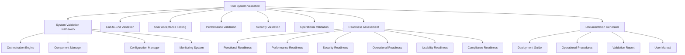

# Final System Validation and Acceptance Testing

## Overview

The Final System Validation and Acceptance Testing framework provides comprehensive validation orchestration for the Integration & Deployment platform. It coordinates all validation types and generates a final system readiness assessment.

## Features

### Comprehensive Validation Coverage

- **End-to-End Validation**: Complete workflow testing from README parsing to CI/CD generation
- **User Acceptance Testing**: Stakeholder validation and feedback collection
- **Performance Validation**: Load testing, scalability verification, and performance benchmarking
- **Security Validation**: Penetration testing, vulnerability scanning, and compliance verification
- **Operational Validation**: Disaster recovery testing and business continuity verification

### System Readiness Assessment

- **Multi-Category Assessment**: Functional, performance, security, operational, usability, and compliance
- **Weighted Scoring**: Intelligent scoring system with category-specific weights
- **Blocker Detection**: Automatic identification of production-blocking issues
- **Readiness Levels**: Production-ready, ready, partially-ready, not-ready classifications

### Stakeholder Management

- **Approval Workflow**: Automated stakeholder approval collection
- **Role-Based Validation**: Technical, security, operational, and business approvals
- **Conditional Approvals**: Support for conditional approvals with specific requirements
- **Approval Tracking**: Complete audit trail of approval decisions

### Documentation Generation

- **Deployment Guides**: Comprehensive deployment instructions
- **Operational Procedures**: Detailed operational runbooks
- **Validation Reports**: Complete validation results and metrics
- **User Manuals**: End-user documentation and training materials

## Architecture



## Usage

### Basic Usage

```typescript
import { 
  FinalSystemValidation, 
  createDefaultFinalValidationConfig 
} from './src/validation/final-system-validation.js';

// Create configuration
const config = createDefaultFinalValidationConfig();

// Initialize validation framework
const finalValidation = new FinalSystemValidation(config);

// Execute complete validation
const result = await finalValidation.executeFinalValidation();

console.log(`Overall Status: ${result.overallStatus}`);
console.log(`Overall Score: ${result.overallScore}/100`);
```

### Command Line Usage

```bash
# Execute complete final validation
node scripts/run-final-validation.ts

# Execute with custom configuration
node scripts/run-final-validation.ts --config ./validation-config.json

# Execute for specific environment
node scripts/run-final-validation.ts --environment production

# Generate configuration file
node scripts/run-final-validation.ts config --output ./my-validation-config.json

# Get quick summary
node scripts/run-final-validation.ts summary
```

### Configuration

#### Basic Configuration

```json
{
  "systemValidation": {
    "environment": "production",
    "testSuites": [
      {
        "name": "End-to-End Validation",
        "type": "end-to-end",
        "enabled": true,
        "timeout": 300000,
        "retries": 2
      }
    ]
  },
  "reporting": {
    "outputDirectory": "./validation-reports",
    "formats": ["json", "html", "pdf"],
    "stakeholders": ["development-team", "operations-team"],
    "distribution": true,
    "archival": {
      "enabled": true,
      "retention": 365,
      "location": "./validation-archive"
    }
  }
}
```

#### Advanced Configuration

See [examples/final-validation-config.json](../examples/final-validation-config.json) for a comprehensive configuration example.

## Validation Types

### 1. System Validation

Comprehensive system-wide validation covering:
- Component integration testing
- Interface validation
- Configuration validation
- Monitoring and alerting validation

### 2. End-to-End Validation

Complete workflow testing including:
- README parsing workflows
- Framework detection workflows
- YAML generation workflows
- Multi-component integration workflows

### 3. User Acceptance Testing

Stakeholder validation covering:
- Functional requirements validation
- Usability testing
- Business process validation
- Stakeholder feedback collection

### 4. Performance Validation

Performance testing including:
- Load testing under expected conditions
- Stress testing to find breaking points
- Scalability testing for horizontal and vertical scaling
- Endurance testing for long-running operations

### 5. Security Validation

Security assessment covering:
- Penetration testing
- Vulnerability scanning
- Compliance validation
- Authentication and authorization testing

### 6. Operational Validation

Operational readiness testing including:
- Disaster recovery testing
- Business continuity validation
- Monitoring system validation
- Maintenance procedure validation

## Readiness Assessment

### Readiness Categories

1. **Functional Readiness** (25% weight)
   - All functional tests passing
   - End-to-end workflows validated
   - Component integration verified

2. **Performance Readiness** (20% weight)
   - Load testing passed
   - Scalability validated
   - Response times within SLA

3. **Security Readiness** (20% weight)
   - Security scans passed
   - Penetration testing completed
   - Compliance validated

4. **Operational Readiness** (15% weight)
   - DR procedures tested
   - Monitoring configured
   - Maintenance procedures documented

5. **Usability Readiness** (10% weight)
   - User acceptance testing passed
   - Documentation complete
   - Training materials ready

6. **Compliance Readiness** (10% weight)
   - Regulatory compliance validated
   - Audit requirements met
   - Policies enforced

### Readiness Levels

- **Production Ready** (95-100%): System is fully ready for production deployment
- **Ready** (85-94%): System is ready with minor improvements needed
- **Partially Ready** (70-84%): System shows promise but needs additional work
- **Not Ready** (<70%): System requires significant improvements

## Stakeholder Approvals

### Required Approvals

1. **Technical Lead**: Technical validation and architecture approval
2. **Security Officer**: Security validation and compliance approval
3. **Operations Manager**: Operational readiness and deployment approval
4. **Product Owner**: Business requirements and user acceptance approval

### Approval Types

- **Approved**: Full approval with no conditions
- **Conditional**: Approval with specific conditions that must be met
- **Rejected**: Approval denied with reasons provided
- **Pending**: Approval request submitted but not yet reviewed

## Documentation Generation

### Generated Documents

1. **Deployment Guide**
   - System requirements
   - Installation procedures
   - Configuration instructions
   - Validation steps

2. **Operational Procedures**
   - Monitoring procedures
   - Maintenance tasks
   - Incident response
   - Emergency contacts

3. **Validation Report**
   - Complete validation results
   - Performance metrics
   - Security assessment
   - Recommendations

4. **User Manual**
   - User guides
   - API documentation
   - Training materials
   - Troubleshooting guides

### Document Formats

- **Markdown**: Human-readable format for version control
- **HTML**: Web-friendly format with interactive elements
- **PDF**: Print-ready format for formal documentation
- **JSON**: Machine-readable format for automation

## Reporting and Analytics

### Report Structure

```json
{
  "reportId": "final-validation-1234567890",
  "timestamp": "2024-01-01T00:00:00Z",
  "overallStatus": "production-ready",
  "overallScore": 96,
  "readinessAssessment": {
    "functional": { "status": "ready", "score": 95 },
    "performance": { "status": "ready", "score": 92 },
    "security": { "status": "ready", "score": 98 },
    "operational": { "status": "ready", "score": 94 },
    "usability": { "status": "ready", "score": 89 },
    "compliance": { "status": "ready", "score": 96 }
  },
  "recommendations": [...],
  "actionItems": [...],
  "approvals": [...],
  "documentation": {...}
}
```

### Metrics and KPIs

- **Overall Readiness Score**: Weighted average of all categories
- **Critical Issues Count**: Number of critical issues blocking production
- **Stakeholder Approval Rate**: Percentage of stakeholders who approved
- **Test Pass Rate**: Percentage of tests that passed
- **Documentation Coverage**: Percentage of required documentation completed

## Integration

### CI/CD Integration

```yaml
# GitHub Actions example
name: Final System Validation
on:
  push:
    branches: [main]
  pull_request:
    branches: [main]

jobs:
  final-validation:
    runs-on: ubuntu-latest
    steps:
      - uses: actions/checkout@v3
      - uses: actions/setup-node@v3
        with:
          node-version: '18'
      - run: npm install
      - run: node scripts/run-final-validation.ts --environment staging
      - uses: actions/upload-artifact@v3
        with:
          name: validation-reports
          path: validation-reports/
```

### API Integration

```typescript
// REST API endpoint
app.post('/api/validation/execute', async (req, res) => {
  const config = req.body.config || createDefaultFinalValidationConfig();
  const finalValidation = new FinalSystemValidation(config);
  
  try {
    const result = await finalValidation.executeFinalValidation();
    res.json(result);
  } catch (error) {
    res.status(500).json({ error: error.message });
  }
});
```

## Best Practices

### Configuration Management

1. **Environment-Specific Configs**: Use different configurations for development, staging, and production
2. **Version Control**: Store validation configurations in version control
3. **Secrets Management**: Use secure secret management for sensitive configuration
4. **Configuration Validation**: Validate configuration before execution

### Test Data Management

1. **Realistic Test Data**: Use production-like data for validation
2. **Data Privacy**: Ensure test data doesn't contain sensitive information
3. **Data Refresh**: Regularly update test data to reflect current scenarios
4. **Data Cleanup**: Clean up test data after validation

### Performance Optimization

1. **Parallel Execution**: Run validation suites in parallel when possible
2. **Resource Management**: Monitor and limit resource usage during validation
3. **Caching**: Cache validation results to avoid redundant testing
4. **Incremental Validation**: Only validate changed components when appropriate

### Error Handling

1. **Graceful Degradation**: Continue validation even if some tests fail
2. **Detailed Logging**: Provide detailed logs for troubleshooting
3. **Error Recovery**: Implement retry mechanisms for transient failures
4. **Error Reporting**: Generate clear error reports with actionable recommendations

## Troubleshooting

### Common Issues

1. **Timeout Errors**
   - Increase timeout values in configuration
   - Check system resources and performance
   - Review test complexity and optimize if needed

2. **Permission Errors**
   - Verify file system permissions
   - Check service account permissions
   - Ensure proper access to external resources

3. **Configuration Errors**
   - Validate configuration syntax
   - Check required fields and values
   - Verify environment-specific settings

4. **Integration Failures**
   - Check component dependencies
   - Verify network connectivity
   - Review API endpoints and credentials

### Debug Mode

Enable verbose logging for detailed troubleshooting:

```bash
node scripts/run-final-validation.ts --verbose
```

### Log Analysis

Check validation logs for detailed error information:

```bash
# View recent validation logs
tail -f validation-reports/validation.log

# Search for specific errors
grep "ERROR" validation-reports/validation.log
```

## Contributing

### Adding New Validation Types

1. Create validation framework in `src/validation/`
2. Implement `ValidationTest` interface
3. Add configuration options
4. Update final validation orchestrator
5. Add comprehensive tests
6. Update documentation

### Extending Readiness Assessment

1. Define new readiness category
2. Implement assessment logic
3. Update scoring weights
4. Add category-specific recommendations
5. Update reporting templates

### Custom Documentation Templates

1. Create Handlebars templates in `templates/`
2. Define template variables
3. Add template configuration
4. Test template rendering
5. Update documentation generator

## License

This project is licensed under the MIT License - see the [LICENSE](../LICENSE) file for details.

## Support

For support and questions:

- Create an issue in the project repository
- Check the troubleshooting guide above
- Review the configuration examples
- Consult the API documentation