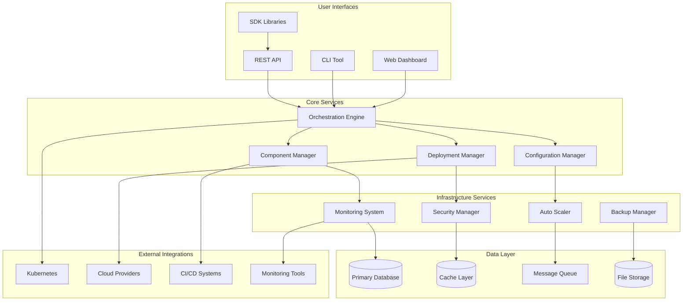

# Integration & Deployment System Documentation

## Overview

Welcome to the comprehensive documentation for the Integration & Deployment System. This documentation provides everything you need to understand, deploy, operate, and maintain the system across different environments and use cases.

## Documentation Structure

### 📐 Architecture Documentation
Detailed technical architecture, component interactions, and system design.

- **[System Architecture](architecture/system-architecture.md)** - High-level architecture, components, and technology stack
- **[Component Interactions](architecture/component-interactions.md)** - Data flow patterns, communication protocols, and integration points

### 🚀 Deployment Guides
Step-by-step deployment instructions for different environments and platforms.

- **[Deployment Guide](deployment/deployment-guide.md)** - Comprehensive deployment instructions for all platforms
- **[Environment-Specific Guides](deployment/environment-specific-guides.md)** - Tailored guides for development, staging, production, and specialized environments

### 🔌 API Documentation
Complete API reference with interactive examples and code samples.

- **[API Documentation](api/api-documentation.md)** - REST API reference, authentication, WebSocket API, and SDK usage

### ⚙️ Operations Documentation
Operational procedures, troubleshooting guides, and maintenance tasks.

- **[Operational Procedures](operations/operational-procedures.md)** - Daily operations, incident response, monitoring, and troubleshooting

### 🎓 Training Materials
Comprehensive training program with hands-on exercises and certification tracks.

- **[Training Materials](training/training-materials.md)** - Multi-track training program with practical exercises and certification

### 👥 User Guides
Persona-specific guides tailored for different user types and responsibilities.

- **[User Guides](user-guides/user-guides.md)** - Guides for developers, DevOps engineers, and system administrators

## Quick Start Guides

### For Developers
1. **Get Started in 5 Minutes**
   ```bash
   # Install CLI
   npm install -g @integration-deployment/cli
   
   # Configure
   id-cli config set api-url https://api.integration-deployment.com/v1
   id-cli config set api-key your-api-key
   
   # Deploy your first application
   id-cli deploy --config deployment.json
   ```
   
   📖 **Full Guide**: [Developer Quick Start](user-guides/user-guides.md#persona-1-software-developer)

### For DevOps Engineers
1. **Deploy the System**
   ```bash
   # Add Helm repository
   helm repo add integration-deployment https://charts.integration-deployment.com
   
   # Install system
   helm install integration-deployment integration-deployment/integration-deployment \
     --namespace integration-deployment \
     --values values.production.yaml
   ```
   
   📖 **Full Guide**: [DevOps Quick Start](user-guides/user-guides.md#persona-2-devops-engineer)

### For System Administrators
1. **Complete System Setup**
   ```bash
   # Run prerequisites check
   ./scripts/prereq-check.sh
   
   # Install and configure system
   ./scripts/install-system.sh production
   
   # Set up monitoring
   ./scripts/setup-monitoring.sh
   ```
   
   📖 **Full Guide**: [Admin Quick Start](user-guides/user-guides.md#persona-3-system-administrator)

## Key Features

### 🎯 Orchestration Engine
- **Workflow Management**: Create, monitor, and manage complex deployment workflows
- **Component Coordination**: Seamless integration between all system components
- **Event-Driven Architecture**: Real-time event processing and notifications
- **Retry Logic**: Intelligent retry mechanisms with circuit breakers

### 🏗️ Deployment Strategies
- **Blue-Green Deployments**: Zero-downtime deployments with instant rollback
- **Canary Deployments**: Gradual rollouts with automated success criteria
- **Rolling Updates**: Progressive updates with configurable batch sizes
- **Multi-Cloud Support**: Deploy across AWS, Azure, GCP, and hybrid environments

### 📊 Monitoring & Observability
- **Real-Time Metrics**: Comprehensive system and application metrics
- **Distributed Tracing**: End-to-end request tracing across components
- **Log Aggregation**: Centralized logging with structured search
- **Intelligent Alerting**: Smart alerts with escalation policies

### 🔒 Security & Compliance
- **Multi-Factor Authentication**: OAuth 2.0, SAML, and API key support
- **Role-Based Access Control**: Fine-grained permissions and user management
- **Data Encryption**: TLS 1.3 in transit, AES-256 at rest
- **Compliance Frameworks**: SOC2, HIPAA, PCI-DSS support

### ⚡ Performance & Scalability
- **Auto-Scaling**: Demand-based scaling with intelligent resource allocation
- **Load Balancing**: Intelligent traffic distribution with health checking
- **Caching Strategy**: Multi-level caching for optimal performance
- **Resource Optimization**: Continuous performance tuning and optimization

## Architecture Overview



## Supported Platforms

### Cloud Providers
- **Amazon Web Services (AWS)**: EKS, Lambda, RDS, CloudFormation
- **Microsoft Azure**: AKS, Functions, CosmosDB, ARM Templates
- **Google Cloud Platform (GCP)**: GKE, Cloud Functions, Firestore
- **Multi-Cloud**: Terraform and Pulumi for infrastructure as code

### Container Orchestration
- **Kubernetes**: Native support with Helm charts
- **Docker Swarm**: Container orchestration and service management
- **OpenShift**: Enterprise Kubernetes platform support

### CI/CD Integration
- **GitHub Actions**: Native workflow integration
- **GitLab CI**: Pipeline integration and deployment automation
- **Jenkins**: Plugin support and pipeline integration
- **Azure DevOps**: Build and release pipeline integration

## System Requirements

### Minimum Requirements
- **CPU**: 4 cores
- **Memory**: 8 GB RAM
- **Storage**: 50 GB SSD
- **Network**: 1 Gbps

### Recommended Requirements
- **CPU**: 8+ cores
- **Memory**: 16+ GB RAM
- **Storage**: 100+ GB SSD
- **Network**: 10 Gbps

### Software Dependencies
- **Node.js**: 18+ with npm/yarn
- **Docker**: 20.10+ and Docker Compose
- **Kubernetes**: 1.24+ (for container orchestration)
- **Database**: PostgreSQL 14+ or MongoDB 5.0+
- **Cache**: Redis 6.2+

## Getting Help

### Documentation
- 📚 **Complete Documentation**: Browse all guides and references
- 🎯 **Quick Start Guides**: Get up and running quickly
- 🔍 **API Reference**: Complete API documentation with examples
- 🛠️ **Troubleshooting**: Common issues and solutions

### Training and Certification
- 🎓 **Training Program**: Multi-track training with hands-on exercises
- 🏆 **Certification**: Three levels of certification available
- 📹 **Video Tutorials**: Step-by-step video guides
- 💡 **Best Practices**: Industry best practices and recommendations

### Community and Support
- 💬 **Community Forum**: Ask questions and share knowledge
- 🐛 **Issue Tracking**: Report bugs and request features
- 📧 **Email Support**: Direct support for enterprise customers
- 📞 **Phone Support**: 24/7 support for critical issues

### Resources
- 📖 **Knowledge Base**: Searchable knowledge base
- 📊 **Status Page**: Real-time system status and incidents
- 📈 **Roadmap**: Product roadmap and upcoming features
- 🔄 **Release Notes**: Latest updates and changes

## Contributing

We welcome contributions from the community! Here's how you can help:

### Documentation
- 📝 **Improve Documentation**: Fix typos, add examples, clarify instructions
- 🌐 **Translations**: Help translate documentation to other languages
- 📚 **Tutorials**: Create tutorials and how-to guides

### Code
- 🐛 **Bug Fixes**: Fix bugs and improve stability
- ✨ **New Features**: Implement new features and enhancements
- 🧪 **Testing**: Add tests and improve test coverage

### Community
- 💬 **Answer Questions**: Help other users in forums and chat
- 📢 **Spread the Word**: Share your experience and use cases
- 🎤 **Speak at Events**: Present at conferences and meetups

## License

This project is licensed under the MIT License. See the [LICENSE](LICENSE) file for details.

## Changelog

### Version 1.0.0 (Current)
- ✅ Complete orchestration engine implementation
- ✅ Multi-cloud deployment support
- ✅ Comprehensive monitoring and alerting
- ✅ Security and compliance features
- ✅ Full API and SDK support

### Upcoming Features
- 🔄 Enhanced auto-scaling capabilities
- 🌐 Multi-region disaster recovery
- 🤖 AI-powered optimization
- 📱 Mobile application support

---

## Document Index

### Architecture
- [System Architecture](architecture/system-architecture.md) - Complete system architecture overview
- [Component Interactions](architecture/component-interactions.md) - Detailed component interaction patterns

### Deployment
- [Deployment Guide](deployment/deployment-guide.md) - Comprehensive deployment instructions
- [Environment-Specific Guides](deployment/environment-specific-guides.md) - Environment-tailored deployment guides

### API & Integration
- [API Documentation](api/api-documentation.md) - Complete REST API reference and examples

### Operations
- [Operational Procedures](operations/operational-procedures.md) - Operations, monitoring, and troubleshooting

### Training & Education
- [Training Materials](training/training-materials.md) - Complete training program with certification

### User Guides
- [User Guides](user-guides/user-guides.md) - Persona-specific user guides and tutorials

---

**Last Updated**: January 2024  
**Documentation Version**: 1.0.0  
**System Version**: 1.0.0