# Component Interactions and Data Flow

## Overview

This document details how components within the Integration & Deployment system interact with each other, including data flow patterns, communication protocols, and integration points.

## Core Component Interactions

### 1. Orchestration Engine Interactions

The Orchestration Engine serves as the central coordinator for all system operations.

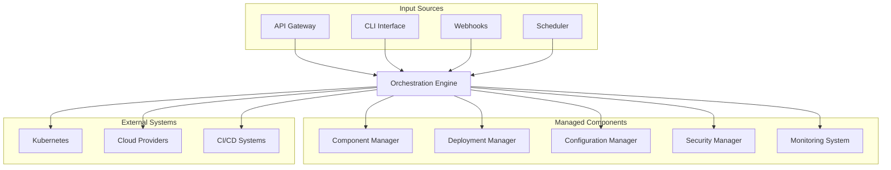

#### Interaction Patterns

**Request Processing Flow:**
1. **Input Validation**: Validate incoming requests against schemas
2. **Authentication**: Verify user credentials and permissions
3. **Workflow Routing**: Route requests to appropriate handlers
4. **Component Coordination**: Orchestrate multi-component operations
5. **Response Aggregation**: Collect and format responses
6. **Event Publishing**: Publish system events for monitoring

**Error Handling Flow:**
1. **Error Detection**: Identify component failures or timeouts
2. **Error Classification**: Categorize errors by type and severity
3. **Recovery Initiation**: Trigger appropriate recovery procedures
4. **Fallback Execution**: Execute fallback operations if needed
5. **Notification**: Alert operators of critical failures

### 2. Component Manager Interactions

The Component Manager handles lifecycle operations for all system components.

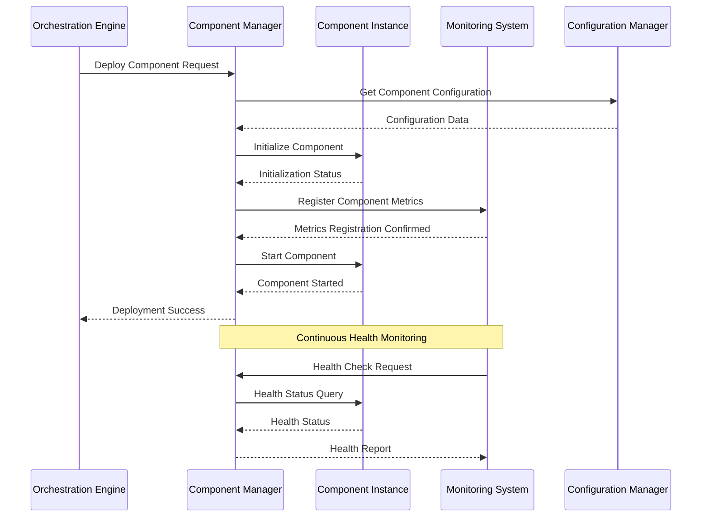

#### Component Lifecycle States

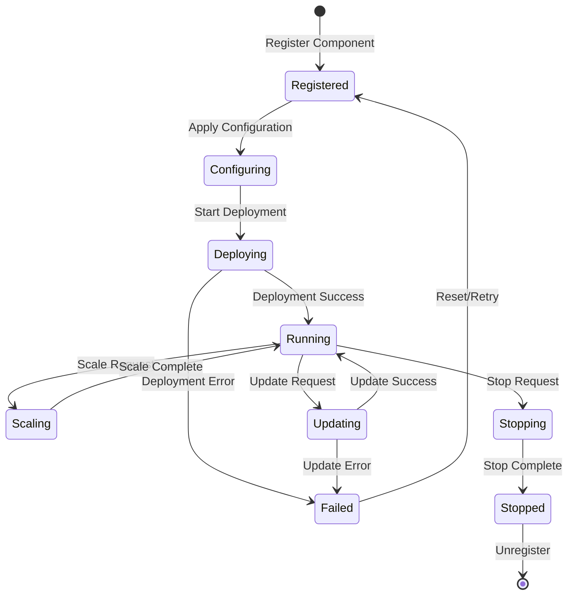

### 3. Deployment Manager Interactions

The Deployment Manager coordinates deployment operations across different environments and platforms.

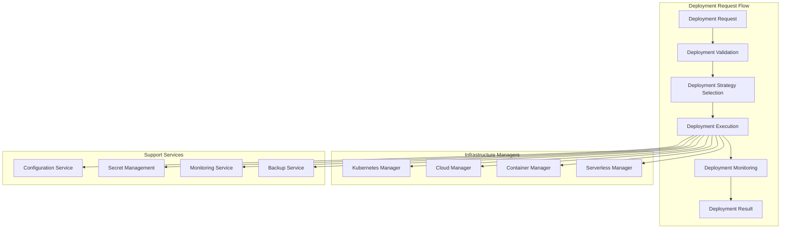

#### Deployment Strategies

**Blue-Green Deployment Flow:**
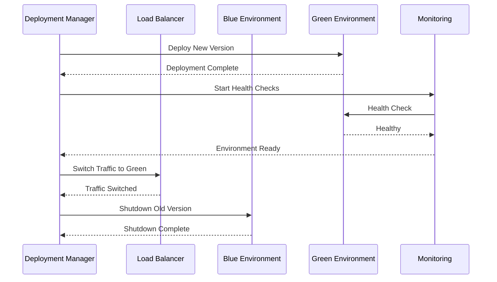

**Canary Deployment Flow:**
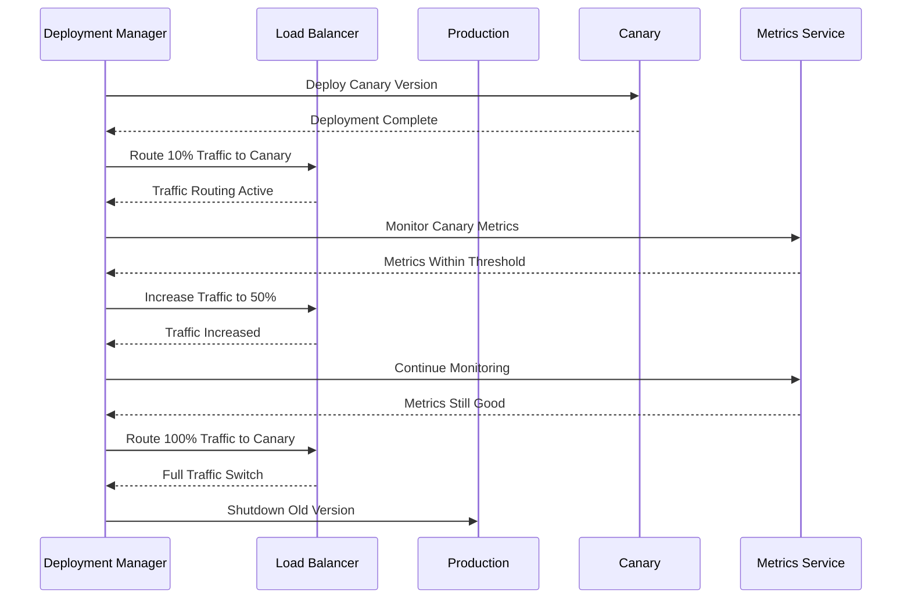

### 4. Configuration Manager Interactions

The Configuration Manager provides centralized configuration and secret management.

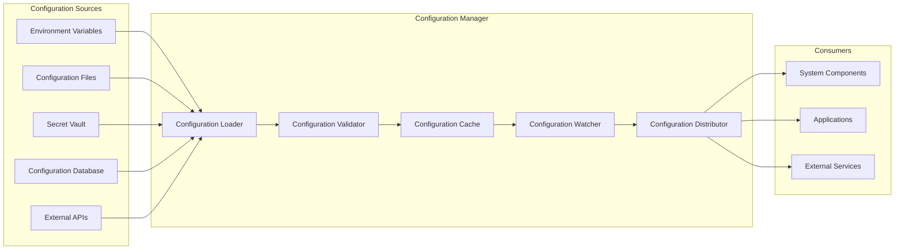

#### Configuration Update Flow

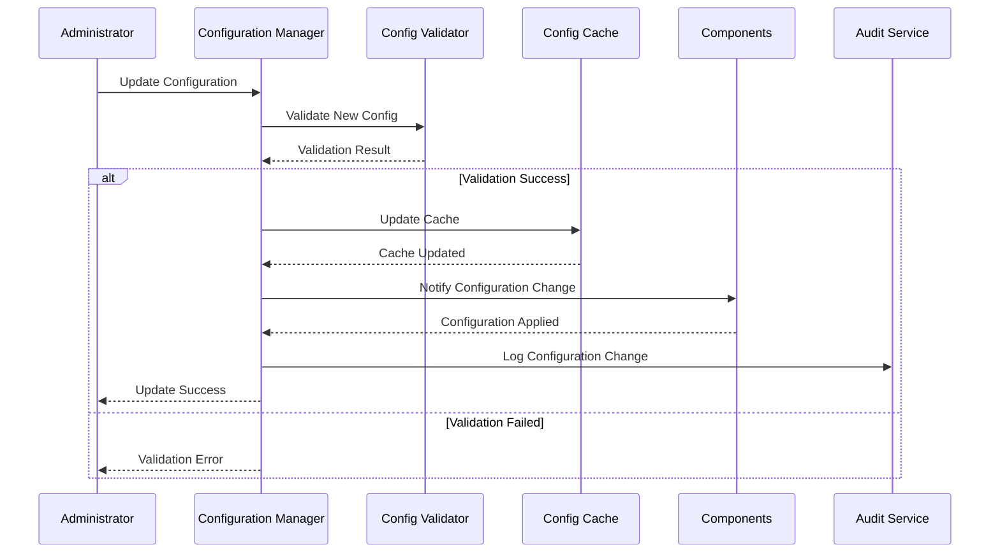

### 5. Monitoring System Interactions

The Monitoring System collects, processes, and analyzes system metrics and events.

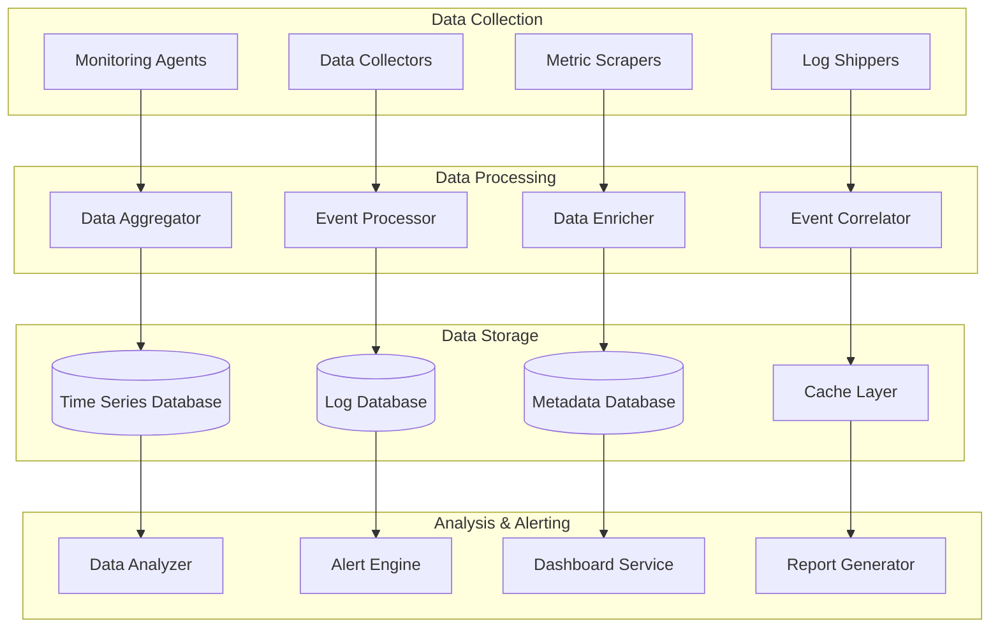

#### Alert Processing Flow

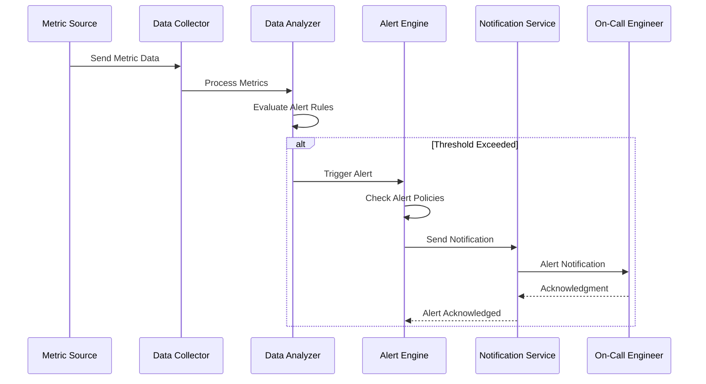

## Data Flow Patterns

### 1. Request-Response Pattern

Used for synchronous operations requiring immediate responses.

```typescript
interface RequestResponseFlow {
  request: {
    id: string;
    timestamp: Date;
    source: string;
    operation: string;
    payload: any;
  };
  response: {
    id: string;
    requestId: string;
    timestamp: Date;
    status: 'success' | 'error';
    data?: any;
    error?: Error;
  };
}
```

### 2. Event-Driven Pattern

Used for asynchronous operations and system notifications.

```typescript
interface EventDrivenFlow {
  event: {
    id: string;
    type: string;
    source: string;
    timestamp: Date;
    data: any;
    metadata: {
      correlationId: string;
      version: string;
      priority: 'low' | 'medium' | 'high' | 'critical';
    };
  };
  handlers: EventHandler[];
}

interface EventHandler {
  id: string;
  eventTypes: string[];
  handler: (event: Event) => Promise<void>;
  retryPolicy: RetryPolicy;
}
```

### 3. Pipeline Pattern

Used for sequential data processing operations.

```typescript
interface PipelineFlow {
  stages: PipelineStage[];
  data: any;
  context: PipelineContext;
}

interface PipelineStage {
  id: string;
  name: string;
  processor: (data: any, context: PipelineContext) => Promise<any>;
  errorHandler: (error: Error, data: any) => Promise<any>;
  timeout: number;
}
```

### 4. Publish-Subscribe Pattern

Used for broadcasting events to multiple subscribers.

```typescript
interface PubSubFlow {
  publisher: {
    id: string;
    publish: (topic: string, message: any) => Promise<void>;
  };
  subscribers: Subscriber[];
  topics: Topic[];
}

interface Subscriber {
  id: string;
  topics: string[];
  handler: (message: any) => Promise<void>;
  filter?: (message: any) => boolean;
}
```

## Integration Points

### 1. External System Integration

**CI/CD System Integration:**
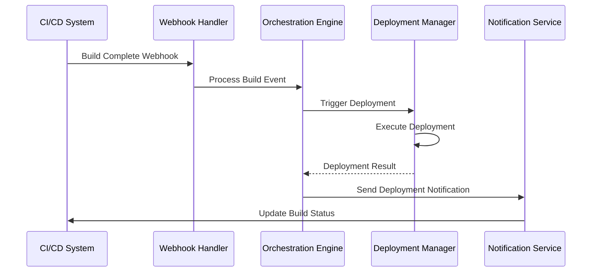

**Monitoring System Integration:**
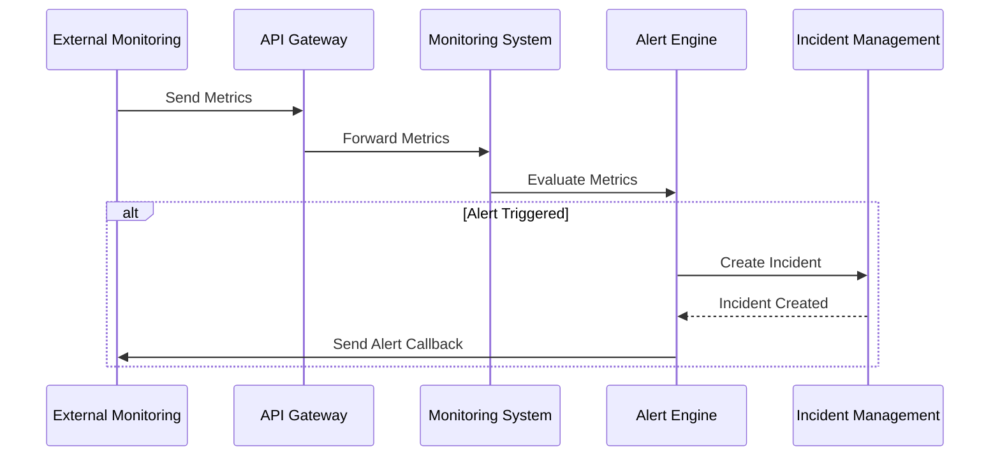

### 2. Database Integration Patterns

**Multi-Database Transaction Pattern:**
```typescript
interface MultiDatabaseTransaction {
  databases: DatabaseConnection[];
  operations: DatabaseOperation[];
  compensations: CompensationOperation[];
  
  execute(): Promise<TransactionResult>;
  rollback(): Promise<void>;
}

interface DatabaseOperation {
  database: string;
  operation: 'create' | 'update' | 'delete';
  table: string;
  data: any;
  conditions?: any;
}
```

**Event Sourcing Pattern:**
```typescript
interface EventStore {
  appendEvent(streamId: string, event: DomainEvent): Promise<void>;
  getEvents(streamId: string, fromVersion?: number): Promise<DomainEvent[]>;
  getSnapshot(streamId: string): Promise<Snapshot>;
  saveSnapshot(streamId: string, snapshot: Snapshot): Promise<void>;
}

interface DomainEvent {
  id: string;
  streamId: string;
  version: number;
  type: string;
  data: any;
  timestamp: Date;
  metadata: any;
}
```

## Performance Optimization

### 1. Caching Strategies

**Multi-Level Caching:**
```mermaid
graph TB
    subgraph "Application Layer"
        APP[Application]
        L1_CACHE[L1 Cache (In-Memory)]
    end
    
    subgraph "Distributed Cache Layer"
        L2_CACHE[L2 Cache (Redis)]
        CACHE_CLUSTER[Cache Cluster]
    end
    
    subgraph "Database Layer"
        DB_CACHE[Database Cache]
        DATABASE[(Database)]
    end
    
    APP --> L1_CACHE
    L1_CACHE --> L2_CACHE
    L2_CACHE --> CACHE_CLUSTER
    CACHE_CLUSTER --> DB_CACHE
    DB_CACHE --> DATABASE
```

### 2. Connection Pooling

**Database Connection Pool:**
```typescript
interface ConnectionPool {
  minConnections: number;
  maxConnections: number;
  acquireTimeout: number;
  idleTimeout: number;
  
  acquire(): Promise<Connection>;
  release(connection: Connection): void;
  destroy(): Promise<void>;
}
```

### 3. Load Balancing Strategies

**Weighted Round Robin:**
```typescript
interface LoadBalancer {
  servers: Server[];
  algorithm: 'round-robin' | 'weighted' | 'least-connections' | 'ip-hash';
  healthCheck: HealthCheckConfig;
  
  selectServer(request: Request): Server;
  updateServerWeights(weights: ServerWeight[]): void;
}
```

This comprehensive documentation provides detailed insights into how components interact within the Integration & Deployment system, enabling developers and operators to understand the system's behavior and optimize its performance.