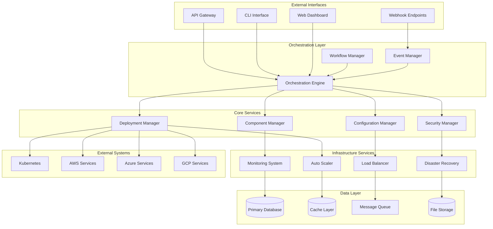
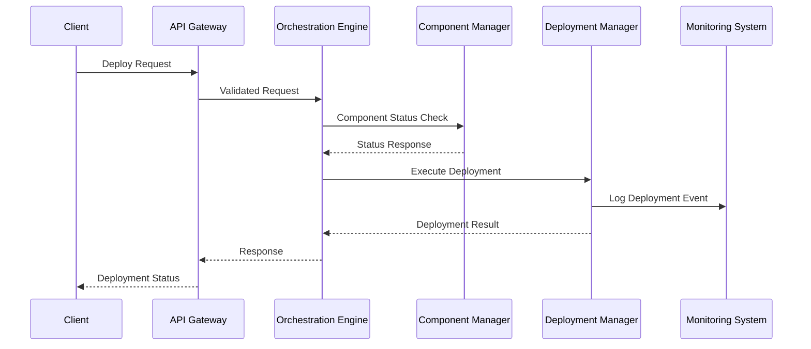
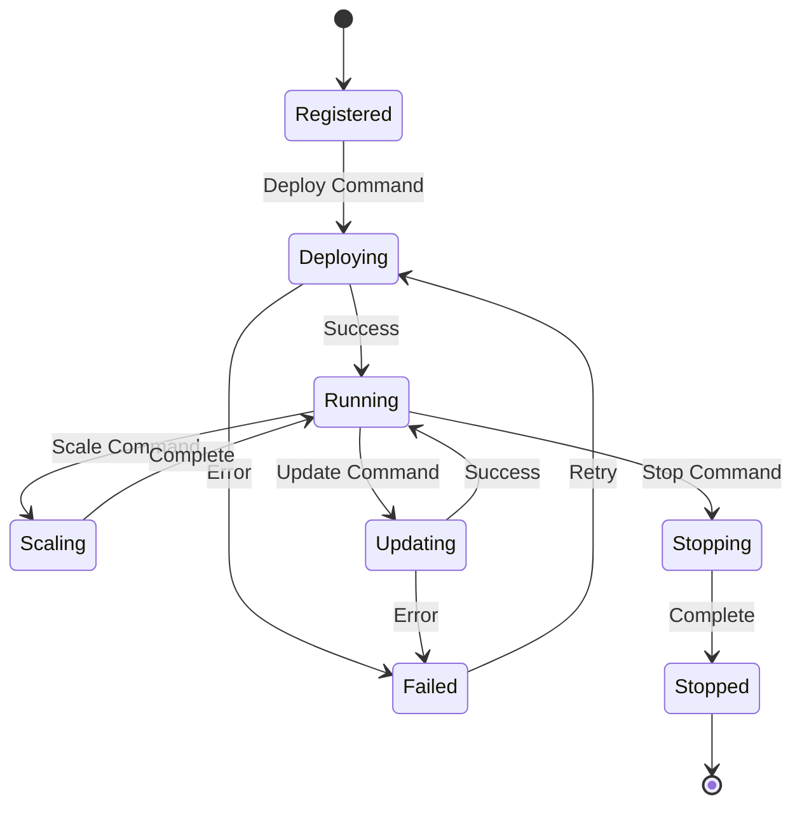
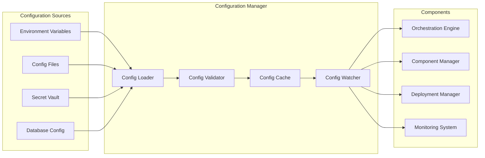
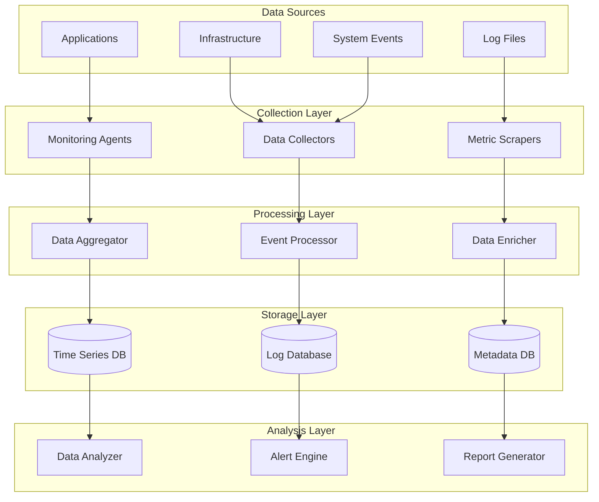
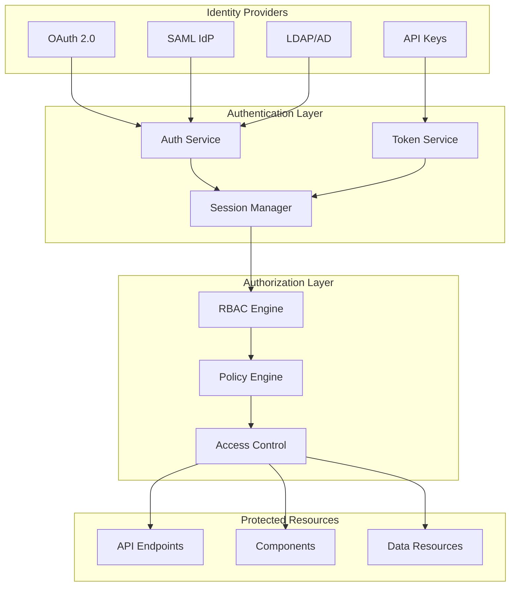
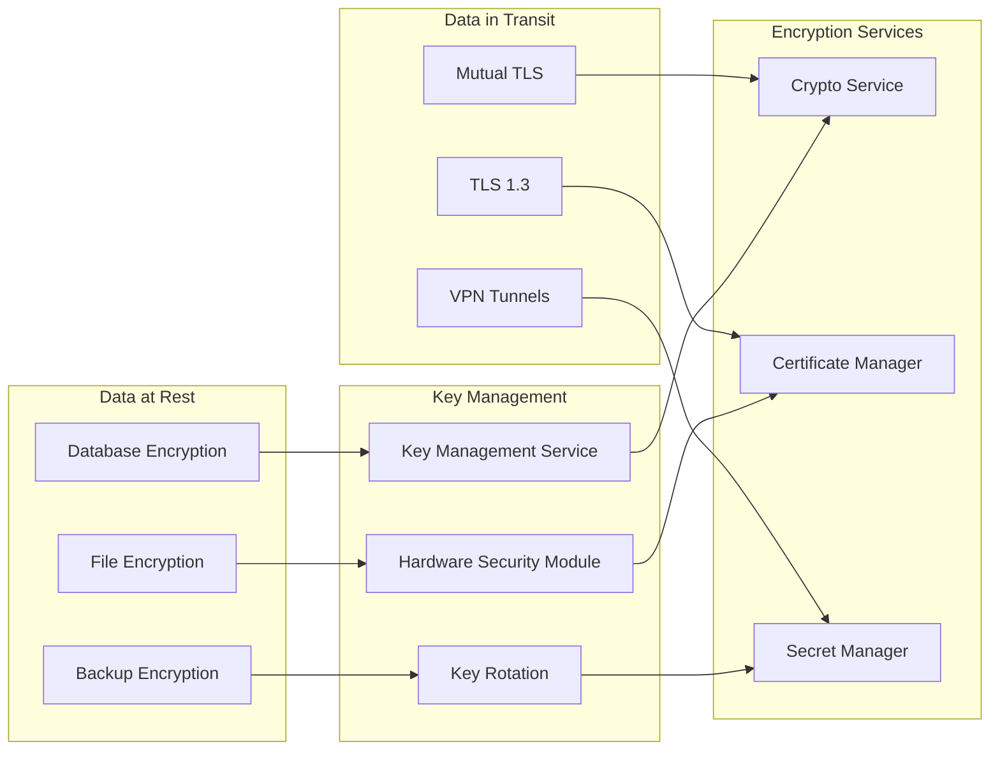
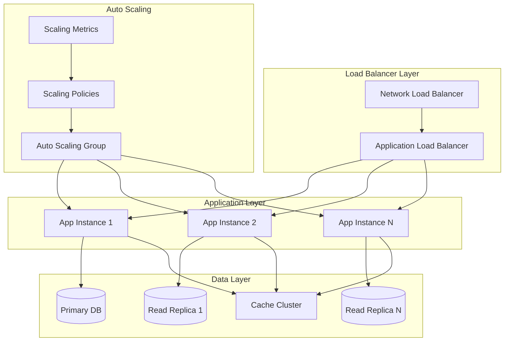
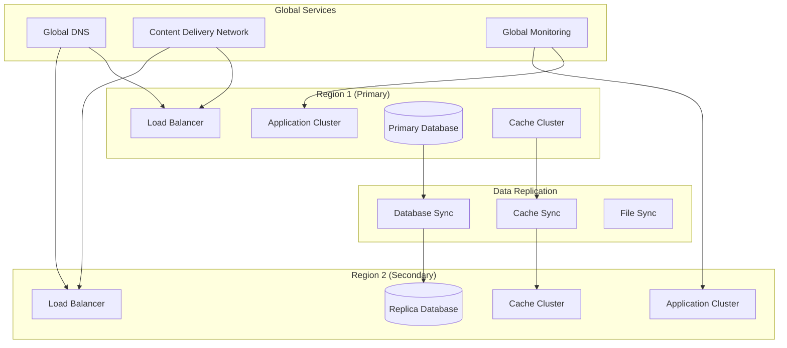

# Integration & Deployment System Architecture

## Overview

The Integration & Deployment system serves as the orchestration backbone for the entire readme-to-cicd platform, providing comprehensive component coordination, deployment management, and operational excellence capabilities.

## High-Level Architecture

## Component Interactions

### 1. Request Flow

### 2. Component Lifecycle Management

## Data Flow Architecture

### 1. Configuration Data Flow

### 2. Monitoring Data Flow

## Security Architecture

### 1. Authentication & Authorization Flow

### 2. Data Encryption Architecture

## Scalability Architecture

### 1. Horizontal Scaling Pattern

### 2. Multi-Region Architecture

## Performance Characteristics

### 1. Latency Requirements

| Component | Target Latency | Maximum Latency |
|-----------|----------------|-----------------|
| API Gateway | < 10ms | < 50ms |
| Orchestration Engine | < 100ms | < 500ms |
| Component Manager | < 200ms | < 1s |
| Deployment Manager | < 1s | < 5s |
| Configuration Manager | < 50ms | < 200ms |
| Monitoring System | < 100ms | < 500ms |

### 2. Throughput Requirements

| Component | Target RPS | Maximum RPS |
|-----------|------------|-------------|
| API Gateway | 10,000 | 50,000 |
| Orchestration Engine | 5,000 | 25,000 |
| Component Manager | 1,000 | 5,000 |
| Deployment Manager | 100 | 500 |
| Configuration Manager | 2,000 | 10,000 |
| Monitoring System | 50,000 | 200,000 |

### 3. Resource Requirements

| Component | CPU (cores) | Memory (GB) | Storage (GB) |
|-----------|-------------|-------------|--------------|
| Orchestration Engine | 2-8 | 4-16 | 10-50 |
| Component Manager | 1-4 | 2-8 | 5-20 |
| Deployment Manager | 2-6 | 4-12 | 20-100 |
| Configuration Manager | 1-2 | 2-4 | 5-10 |
| Monitoring System | 4-16 | 8-32 | 100-1000 |
| Database | 4-16 | 16-64 | 500-5000 |

## Technology Stack

### Core Technologies
- **Runtime**: Node.js 18+, TypeScript 5+
- **Framework**: Express.js, Fastify
- **Database**: PostgreSQL, MongoDB, Redis
- **Message Queue**: Apache Kafka, RabbitMQ
- **Container**: Docker, Kubernetes
- **Monitoring**: Prometheus, Grafana, Jaeger

### Cloud Services
- **AWS**: EKS, Lambda, RDS, CloudFormation
- **Azure**: AKS, Functions, CosmosDB, ARM
- **GCP**: GKE, Cloud Functions, Firestore
- **Multi-Cloud**: Terraform, Pulumi

### Security & Compliance
- **Authentication**: OAuth 2.0, SAML, OpenID Connect
- **Secrets**: HashiCorp Vault, AWS Secrets Manager
- **Encryption**: TLS 1.3, AES-256, RSA-4096
- **Compliance**: SOC2, HIPAA, PCI-DSS

This architecture provides a robust, scalable, and secure foundation for the Integration & Deployment system, ensuring reliable operation across diverse deployment scenarios and enterprise requirements.